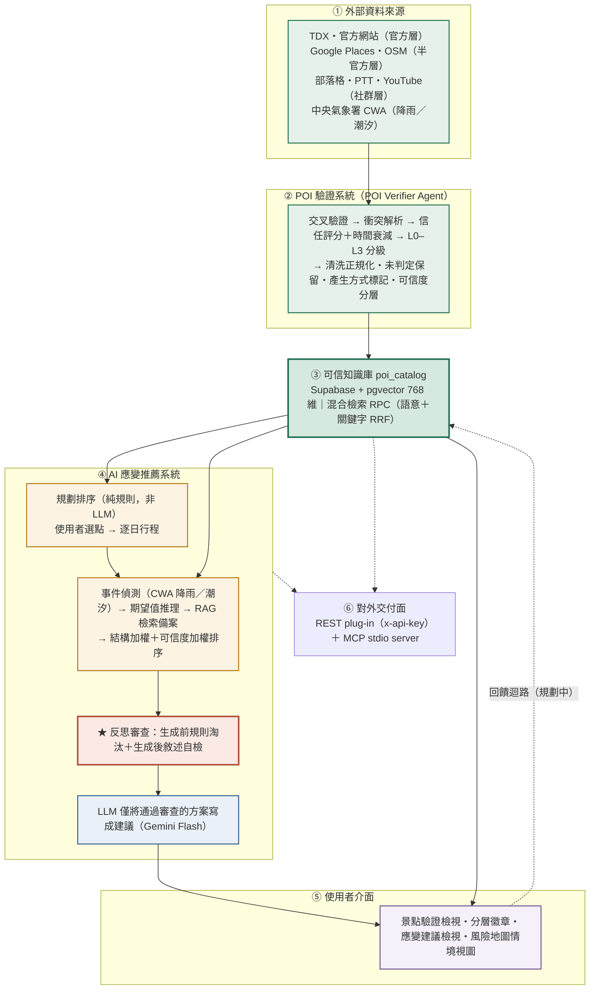
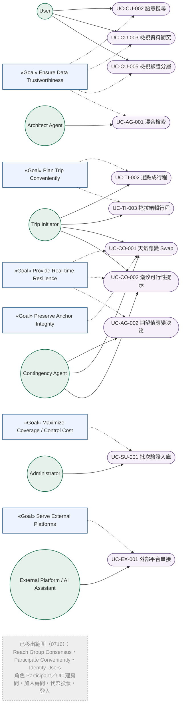

# 2026 年全國大專校院智慧創新暨跨域整合創作競賽

## Software Requirement Specification（系統需求書）

## 領航者 Navigator — 可信景點資料庫與即時韌性應變系統

> **本檔版本：v0.6（2026-08-03）**。基準為 `Navigator_系統需求書_0721.docx`（v0.4），依序併入 v0.5（資料清洗流程、失效行為、NFR 追溯與驗收準則）與 v0.6（0802–0803 實作與線上資料重跑後的現況）。
>
> **歷史版本存檔**：v0.4 見 `Navigator_系統需求書_0721.docx`；v0.5 見 `Navigator_系統需求書_0722.md`（檔名沿用 v0.4 定稿後最後一次異動日，內容為 v0.5）。本檔為現行有效版本。

> ⚠️ v0.3（2026-07-16）範圍縮減：多人規劃（房間／投票／共識收斂）與 Auth 登入移出本期範圍，相關需求以 ~~刪除線~~ 保留原編號註記，不重排。詳 `0716_減法決策與不做清單.md`。
>
> ⚠️ **「Architect Agent」為舊設計沿用的模組名稱，實際上不是 LLM agent。** 草案行程排序是純規則邏輯（區域分群＋最近鄰＋時間切天，`src/lib/draft-itinerary.ts`），沒有 LLM 呼叫；本文件內少數描述仍寫著「依投票結果」為 v0.2 遺留未同步，實際輸入已改為使用者自驗證庫選點（見 BFR7、UC-TI-002）。系統唯一的 LLM-driven agent 是 Contingency Handler。此份 SRS 的正式編號（BFR6/7、IIR4、角色矩陣等）暫不重新命名或重排，僅在此註記澄清，避免後續開發或 AI 協作誤將「Architect Agent」當成需要串接 LLM 的功能。詳見 `系統架構圖_競賽版.md`、`CLAUDE.md` §2。
>
> ⚠️ **v0.6 對外表述更正**：交叉驗證來源**目前實際最多 5 類**（Google Places、OSM、部落格、官方網站、PTT）。YouTube 驗證器需 `YOUTUBE_DATA_API_KEY`，目前未設定，全庫貢獻為 0；TDX 為匯入來源、既有 45 筆未經其驗證。**對外文件與簡報不得宣稱「7 類交叉驗證」**，應寫「已接 6 類驗證器，現行資料實測最多 5 類」。

---

> 撰寫格式參照台大軟體工程課程 SRS 範本（Meeting Scheduler）。

---

## Revision History

| 版次 | 負責人 | 日期 | 變更項目敘述 | 審查者 | 審查日期 |
|---|---|---|---|---|---|
| 0.1 | — | 2026/07/15 | 建立 SRS 文件架構，依範本填入 Navigator 系統架構、功能／介面／非功能需求 | 全體組員 | — |
| 0.2 | — | 2026/07/15 | 新增目標導向使用案例、角色矩陣、追溯矩陣 | 全體組員 | — |
| 0.3 | — | 2026/07/16 | 範圍縮減：多人規劃（房間/投票）移出範圍（詳 `0716_減法決策與不做清單.md`），新增 FFR13 選點成行程；相關 FFR/UC 標註移除、不重排編號 | 全體組員 | — |
| 0.4 | — | 2026/07/21 | 補繪圖 1（系統架構圖）、圖 2（目標導向使用案例圖）Mermaid；一致化 §5.2 目標與 §5.4 角色矩陣殘留之多人／投票／登入項為移出範圍 | 全體組員 | — |
| 0.5 | — | 2026/08/03 | 依 0730 企劃書之 Decision-first AI 三層敘事對齊架構（§1.3）；新增 §2.3 資料清洗與出處模組（BFR11–BFR18，回應教授 0729「資料清洗流程」指示）；EIR 補「失效行為」欄並新增 EIR7 潮汐預報；新增 NFR9 資料可稽核性、NFR10 外部相依韌性；新增 §6.4 NFR 追溯矩陣與 §7 驗證與驗收準則 | 全體組員 | — |
| **0.6** | — | **2026/08/03** | 併入 0802–0803 實作：新增 FFR15 驗證分層呈現、BFR19 可信度參與排序、BFR20 解釋文字忠實性、§2.4 對外交付面（BFR21／BFR22）、IIR9；新增 NFR11 時間與時區正確性；更新 EIR1（TDX 觀光 API 改版重接）與 IIR5（應變管線改讀 `poi_catalog`）；**依 45 筆重跑後之線上實測結果更新 §7 驗收現況並新增 §7.2 資料現況快照**；更正對外可宣稱之驗證來源類別數 | 全體組員 | — |

---

## 1. System Architecture（系統架構）

### 1.1 Introduction（簡介）

旅遊規劃的情境中，使用者面臨兩個真實痛點：

1. **網路景點資訊真假難辨**：部落格、社群、地圖上的資訊彼此衝突、品質不一，使用者難以判斷可信度；直接詢問一般 LLM 更可能得到幻覺答案。
2. **行程缺乏應變邏輯**：遇到天氣、交通、景點臨時關閉等突發狀況時，沒有系統化的備案思路，只能臨場慌亂重排。

觀察現有的旅遊規劃工具（TripAdvisor、Google Places、MindTrip 等），多聚焦於「景點推薦與資訊聚合」，鮮少有系統同時處理「資料可信度」與「行程進行中的即時韌性」。

本專案「領航者 Navigator」建立在一個**經多來源交叉驗證的可信景點知識庫**之上，強調兩件事：以多來源信度與衝突透明化建立**資料可信度**、以錨點分級（L0–L3）與事件觸發達成**即時韌性**。系統以涵蓋全台灣景點的廣度為核心差異化，用堪用且成本可控的 AI 技術（RAG 混合檢索、輕量 LLM），讓旅遊資訊「查得到、信得過、變得動」，並以 Plug-in 服務形式（REST ＋ MCP）串接既有旅遊平台與 AI 助理。

本專案以 Next.js（App Router）建構前端與 BFF、以 Supabase（PostgreSQL + pgvector）為知識庫、以 Gemini 系列模型負責向量化與生成，並整合 TDX 觀光資料、中央氣象署開放資料等官方即時來源。

### 1.2 Architecture Expression（架構表達）

系統以 `poi_catalog`（可信景點知識庫）為全域樞紐，由 POI 驗證系統作為「生產者」寫入，由行程規劃與應變系統作為「消費者」讀出。主要模組如下：

| 模組 Module | 說明 Description |
|---|---|
| POI Verifier Agent（景點驗證代理） | 對外部來源資料進行清理標準化、多來源交叉驗證、衝突解析、信任評分、L0–L3 分級與 RAG 語意描述，輸出驗證後景點。 |
| Knowledge Base（知識庫模組） | `poi_catalog` 主知識庫，儲存事實欄位、metadata 與 768 維向量嵌入，提供 pgvector 混合檢索 RPC。 |
| Architect Agent（規劃代理，非 LLM，見上方註記） | 依使用者自驗證庫選點結果，透過漏斗式檢索（SQL 結構化過濾 + 語意向量）產出草案行程。**（v0.3：輸入由投票結果改為使用者選點）** |
| Contingency Handler Agent（應變處理代理） | 偵測天氣／潮汐等事件，以期望值評估是否觸發應變，從知識庫撈出合格備案並產出 Swap／Switch 建議。**（v0.6：候選來源由靜態景點表改為直接讀 `poi_catalog`，見 IIR5）** |
| ~~Trip Room Module（行程房間模組）~~ | ~~提供建立房間、多人加入、presence 管理。~~ **0716 移出範圍** |
| Exploration Module（景點探索模組） | 提供語意搜尋與資料可信度／分層／衝突呈現（滑卡探索保留實作、非核心）。 |
| ~~Voting Module（投票模組）~~ | ~~提供代幣投票（VETO／MUST-GO／Like）與收斂結果。~~ **0716 移出範圍** |
| Itinerary Module（行程模組） | 提供使用者自驗證庫選點組成行程、行程檢視、拖拉編輯與地圖視覺化。 |
| ~~Authentication Module（身分驗證模組）~~ | ~~提供使用者註冊、登入與權限判定（Supabase Auth）。~~ **延後賽後** |
| Ingestion Pipeline（入庫管線） | 將驗證後景點向量化並 upsert 至 `poi_catalog`，含 TDX 批次匯入。 |
| Data Cleansing & Provenance（資料清洗與出處） | 在入庫前執行欄位正規化、未判定值保留、產生方式標記與可信度分層；決定一筆資料是否夠格進入知識庫。詳 §2.3。 |
| **Delivery Surface（對外交付面）（v0.6 新增）** | 以 REST plug-in 端點（金鑰把關＋CORS）與 MCP stdio server 兩種形式，把知識庫與應變能力交付給外部平台與 AI 助理。詳 §2.4、`docs/adr/0001`、`PLUGIN_API.md`。 |

### 1.3 Decision-first AI 三層對應（Layer Mapping）

企劃書將系統定位為 **Decision-first AI**——把「建立知識、決策推理、自然語言表達」三個階段明確分離，使語言模型的角色從**決策制定者**變成**決策說明者**。本 SRS 的模組與該三層對應如下，作為後續功能需求編號的分群依據：

| 企劃書層級 | 職責邊界 | 對應模組 | 對應需求 |
|---|---|---|---|
| **知識層 Knowledge** | 建立可信資料。此層**不做決策**，只負責「這筆資料是什麼、可不可信、怎麼來的」 | POI Verifier Agent、Data Cleansing & Provenance、Knowledge Base、Ingestion Pipeline | BFR1–BFR5、**BFR11–BFR17** |
| **推理層 Reasoning** | 完成決策。此層**不呼叫語言模型做最終判定**，由期望值模型與多準則排序決定 | Architect Agent（純規則）、Contingency Handler 的偵測／EV／篩選／排序 | BFR6–BFR10、**BFR19** |
| **表達層 Communication** | 把已確定的決策轉成自然語言。此層**不得推翻上層結論，也不得對未判定的資料宣稱知道** | Contingency Handler 的敘述生成與反思迴路、排序理由文字 | **BFR18、BFR20** |

> **層級不可跨越的約束**：推理層的淘汰結果與關鍵限制（L0 鎖定、營業狀態、天氣適合度）對表達層具有覆蓋權；表達層若產出引用了被淘汰或不存在的景點，須由反思迴路攔截並重新生成，仍不通過則改用規則保底輸出。此約束由 BFR18 規範、NFR8 與 NFR9 保障。
>
> **v0.6 補充的第二條約束**：表達層描述某欄位時，其確定性不得高於知識層對該欄位的實際確定性。若欄位為未判定（`null`），解釋文字須明說「未判定」，不得複述推理層為維持排序而借用的預設值。此約束由 BFR20 規範——它是 BFR12（未判定值保留）在文字輸出面的延伸：資料層分得出「不知道」，但如果解釋文字把它講成「知道」，使用者看到的仍然是謊言。

**圖 1：系統架構圖**（三層定位：資料層／推理層／LLM 層；詳版見 `系統架構圖_競賽版.md`）

> 資料流：外部資料來源 →（POI Verifier Agent）→ `poi_catalog` 知識庫 →（規劃排序／Contingency Handler Agent）→ 使用者介面／對外交付面；使用者回饋回流形成資料閉環。**關鍵主張：LLM 不做決策**，僅將已決定的方案轉為自然語言。

---

## 2. Functional Requirement（功能需求）

### 2.1 Front-end Functional Requirements（前端功能需求）

**~~Trip Room Module（行程房間模組）~~ — 0716 全模組移出範圍**

| 編號 | 名稱 | 描述 |
|---|---|---|
| ~~FFR1~~ | ~~Create Trip Room（建立行程房間）~~ | **0716 移出範圍**（多人規劃砍除，程式碼保留） |
| ~~FFR2~~ | ~~Join Trip Room（加入行程房間）~~ | **0716 移出範圍**（同上） |

**Exploration Module（景點探索模組）**

| 編號 | 名稱 | 描述 |
|---|---|---|
| FFR3 | Swipe to Explore POIs（滑卡探索景點） | 系統以 Tinder 式卡片呈現候選景點，使用者以左右滑動表達喜歡／略過。**（0716 註記：保留實作、非核心功能，不入競賽敘事）** |
| FFR4 | POI Semantic Search（景點語意搜尋） | 使用者輸入自然語言查詢（如「下雨天想找室內景點」），系統回傳經 RAG 混合檢索排序的景點結果，並附排序理由。空查詢維持零 LLM 成本的清單模式，有查詢才呼叫嵌入與混合檢索。 |
| FFR5 | View Reliability & Conflicts（檢視可信度與資料分歧） | 景點卡片顯示資料來源數與信任分數；若多來源資料不一致，顯示「資料分歧」徽章，詳情面板列出各來源版本、採用值與判定方式。 |
| FFR15 | View Verification Tier（檢視驗證分層）**（v0.6 新增）** | 景點卡片與詳情面板須呈現該筆資料的驗證層級（BFR16），且**四種狀態必須彼此可分**：`tier_2`（三源核驗）／`tier_1`（交叉驗證）／`tier_0`（單一來源匯入，不得表述為「已驗證」）／`unverified`（驗證時語言模型降級，智能欄位是預設值）。`null`（分層機制上線前入庫、尚未判定）不顯示徽章，但須於詳情面板以文字說明，**不得顯示為 `tier_0`**。分層資訊須排在可信度分數之前呈現。**理由**：分數回答「多可信」，分層回答「驗到什麼程度」；沒有後者，跨層級比較分數沒有意義。此需求存在的唯一目的，是讓使用者能回答「這一堆裡哪些是真的驗過的」——而那正是本作品的核心主張。 |

**~~Voting Module（投票模組）~~ — 0716 全模組移出範圍**

| 編號 | 名稱 | 描述 |
|---|---|---|
| ~~FFR6~~ | ~~Token Voting（代幣投票）~~ | **0716 移出範圍**（多人規劃砍除，程式碼保留） |
| ~~FFR7~~ | ~~View Voting Results（檢視收斂結果）~~ | **0716 移出範圍**（同上） |

**Itinerary Module（行程模組）**

| 編號 | 名稱 | 描述 |
|---|---|---|
| FFR8 | View Draft Itinerary（檢視行程） | 系統將使用者選定的景點組成逐日、逐時段行程呈現檢視。**（v0.3：行程來源由投票結果改為 FFR13 使用者選點）** |
| FFR9 | Drag-and-drop Edit Itinerary（拖拉編輯行程） | 使用者可拖拉調整景點順序、跨日搬移，支援觸控手勢，L0 絕對錨點不可被拖離其鎖定時段。 |
| FFR10 | Map Visualization（地圖視覺化） | 系統於地圖上顯示行程景點與當日路線，小螢幕支援地圖與卡片列 peek 並存。 |
| FFR13 | Build Itinerary from Verified POIs（自驗證庫選點成行程）**（v0.3 新增）** | 使用者於驗證景點庫瀏覽時，可將景點加入行程；系統依地理鄰近與停留時間簡單排序，組成天氣應變的作用對象行程。傳遞給下游的識別碼須為知識庫的 `source_id`，不得混用資料表主鍵。 |

**Contingency Module（應變模組）**

| 編號 | 名稱 | 描述 |
|---|---|---|
| FFR11 | Weather Contingency Suggestion（天氣應變建議） | 當偵測到當日高降雨機率影響戶外景點時，系統主動提示，並提供同區室內備案的 Swap 建議，附替換理由與信度。查無該站點資料時須顯示「天氣資料待補」，**不得靜默略過該站點**。 |
| FFR12 | Accept / Reject Swap（接受／拒絕應變建議） | 使用者可選擇接受某個備案以替換原景點（系統更新使用者的真實行程草稿並重算當日交通時間），或拒絕保留原行程。 |
| FFR14 | Tide Feasibility Advisory（潮汐可行性提示）**（v0.5 新增）** | 對受潮汐影響的海岸景點，系統依中央氣象署鄉鎮潮汐預報（EIR7）判定造訪時段之風險：接近滿潮時提示該時段不宜前往並建議可行時段；查無資料時顯示「潮汐資料待補」而非「適合前往」。與天氣應變**並行且互不依賴**（不下雨也可能因滿潮白跑）。**設計理由**：潮汐是逐日變動的天文計算而非靜態事實，語言模型無法由既有知識推得，只能查詢——此為 Decision-first AI 主張「知識層先於模型」最具體的案例。適用如神祕海岸（僅退潮可通行）、老梅綠石槽（退潮方為最佳狀態）等「去了會白跑」的典型情境。 |

### 2.2 Back-end Functional Requirements（後端功能需求）

**POI Verification Module（景點驗證模組）**

| 編號 | 名稱 | 描述 |
|---|---|---|
| BFR1 | Multi-source POI Verification（多來源景點驗證） | 對每筆景點交叉比對 Google Places、OSM、部落格、官方網站、PTT、YouTube 等來源，確認存在性並計算來源信度；TDX 為官方匯入來源。**（v0.6 註記：驗證器已接 6 類，但 YouTube 需 API 金鑰、目前未啟用，現行資料實測最多 5 類；對外不得宣稱 7 類。）** |
| BFR2 | Conflict Resolution（衝突解析） | 對名稱／地址／營業時間／是否營業等欄位，以兩步驟規則處理來源衝突：能澄清（依可信度層級或時效）則採可信版本，否則多版本並存並標記 `is_conflicted`。 |
| BFR3 | Resilience Classification & Enrichment（韌性分級與加值） | 為每筆景點標定 L0–L3 韌性等級、室內外、天氣敏感度、備案策略與決策標籤。**缺值時不得填入型別預設值，須依 BFR12 保留 `null`。** |

**Knowledge Base Module（知識庫模組）**

| 編號 | 名稱 | 描述 |
|---|---|---|
| BFR4 | Embedding & Ingestion（向量化入庫） | 將驗證後景點組成語意字串，經 Gemini 產生 768 維向量，連同事實欄位與 metadata upsert 至 `poi_catalog`。未判定欄位不得寫入語意字串（否則錯誤值會被烘進向量，日後修正必須連帶重建嵌入）。 |
| BFR5 | Hybrid Search（混合檢索） | 提供 `hybrid_search_poi_catalog` RPC，結合 pgvector 語意向量與 pg_trgm／全文關鍵字，以 RRF 排名融合回傳候選。 |

**Architect Agent Module（規劃代理模組；非 LLM agent，純規則排序，見文首註記）**

| 編號 | 名稱 | 描述 |
|---|---|---|
| BFR6 | Funnel Retrieval（漏斗式檢索） | 依區域、室內外、營業時段等結構化條件先過濾，再以語意向量補足 vibe，最後依 Level 重排，壓低 Token 成本。 |
| BFR7 | Draft Itinerary Generation（草案行程生成） | 依使用者選定的景點（FFR13），考量停留時間與景點間距，產生逐日行程骨架。**（v0.3：輸入由投票收斂結果改為使用者選點）** |

**Contingency Handler Module（應變處理模組）**

| 編號 | 名稱 | 描述 |
|---|---|---|
| BFR8 | Event Detection（事件偵測） | 以中央氣象署資料偵測行程日的降雨機率等天氣事件，以及潮汐可行性（FFR14），作為應變觸發器。 |
| BFR9 | Expected Value Evaluation（期望值評估） | 以 EV = P_晴 × L + P_雨 × (L × α) 計算景點期望值，當分數落差超過門檻即判定應觸發應變。 |
| BFR10 | Swap / Switch Decision（替換／切換決策） | 觸發後從知識庫撈出合格備案，於同層級內替換（Swap）或切換整段行程型態（Switch），L0 禁止自動替換。候選須排除來源明確標示為永久停業者（BFR17）。 |
| BFR19 | Reliability-aware Reranking（可信度參與排序）**（v0.6 新增）** | 檢索與備案排序須將多來源可信度 `reliability_score` 納入計分，使高可信度景點在同等場景條件下排前。**量級約束**：可信度加權（±0.15 量級）不得蓋過場景加權（±0.3–1.0，如「下雨優先室內」）——可信度只在場景條件相同時用來分高下。`reliability_score` 缺漏時不加權，**不得補預設分數**。**理由**：在此需求成立之前，系統在畫面上宣稱可信度重要（首頁秀「平均可信度 N%」），但使用者一輸入查詢，三源核驗 0.855 與單源 0.35 的景點排序完全相同——宣稱重要卻沒有真的拿它排序。 |

### 2.3 Data Cleansing & Provenance Requirements（資料清洗與出處需求）

> **本節回應教授 2026-07-29 指示**：企劃書應著重「整體架構設計、**資料清洗流程**與商業應用情境」。
>
> 本節之所以獨立成節而非併入 BFR1–BFR3，是因為專案實作過程中**所有已知的資料事故都發生在這一層**，而非驗證邏輯本身。清洗規則若不成為需求，就只是實作細節，出錯時沒有任何一條規格會被違反——這正是下述事故長達三個月未被發現的原因。
>
> 貫穿本節的單一原則：**「不知道」必須與「知道是否」在資料層可區分。**

**Data Cleansing & Provenance Module（資料清洗與出處模組）**

| 編號 | 名稱 | 描述 |
|---|---|---|
| BFR11 | Field Normalization（欄位正規化） | 同一語意的欄位須以單一格式入庫，不得因來源不同而並存多種寫法。至少涵蓋：電話（國碼／括號區碼一律正規化為 `0X-XXXXXXXX`，分機以 `#` 後綴）、縣市（「台」「臺」統一）、地址（結構化欄位組回單行時的欄位順序固定）。**理由**：格式分歧會在跨來源比對時製造假不相等，使同一實體被判為兩筆。 |
| BFR12 | Undetermined Value Preservation（未判定值保留） | 當某欄位無法被判定時，該欄位須以 `null` 入庫，**不得以型別預設值（`false` / `0` / `'medium'`）填補**。下游任何硬性篩選不得將 `null` 等同於「判定為否」。**適用欄位**：`is_indoor`、`weather_sensitivity`、`verification_tier`、`service_status`。**理由**：本專案曾因以 `?? false` 補 `is_indoor`，使 45 筆中 41 筆被標為戶外，而應變管線的下雨路徑是 `is_indoor = true` 的硬性篩選，導致三個區域中有兩個候選池為空——功能回傳成功、資料型別正確、無任何錯誤訊息。 |
| BFR13 | Provenance Marking（產生方式標記） | 每筆入庫資料須記錄其智能欄位的產生方式（`llm_source`：真實模型輸出／規則推導／降級預設），使「經過判斷的資料」與「未經判斷的資料」在資料庫層即可查詢區分。**理由**：降級資料若與正常資料結構相同，就無法被抽樣、無法被重跑、也無法被統計。 |
| BFR14 | Batch Degradation Abort（批次降級中止） | 批次入庫過程中連續 N 次（預設 3）走降級分支時，須中止批次並以非零結束碼回報已完成筆數與中止原因；**降級結果不得入庫**。批次結束須輸出成功／降級／失敗三項計數。**理由**：外部模型配額耗盡屬預期內事件，若逐筆吞掉，45 筆會產生 30 筆垃圾、1000 筆會產生 900 筆，且規模愈大愈不易察覺。 |
| BFR15 | Source Inconsistency Handling（來源內部矛盾處理） | 除跨來源衝突（BFR2）外，**單一來源內部欄位互相矛盾**時亦須有明定取捨順序，並在文件標註不可信的欄位層級。**實例**：官方 TDX 資料中，滿月圓國家森林遊樂區的 `Town`／`ZipCode` 為「八里區／249」，`StreetAddress` 為「三峽區有木里」，實際位於三峽區。縣市層級取捨後仍正確（兩者皆為新北市，`region` 推導不受影響），**鄉鎮層級則不可信**——任何用到鄉鎮的功能（如潮汐鄉鎮查詢）不得直接採信 `Town`／`ZipCode`。 |
| BFR16 | Verification Tiering（可信度分層） | 每筆景點須標記可信度層級，使不同驗證強度的資料在同一張表、同一組 API 回應中仍可區分：`tier_0`（政府單一來源匯入，未交叉驗證）／`tier_1`（多來源交叉驗證通過，來源數 ≥2）／`tier_2`（含官方網站或衝突已裁決，來源數 ≥3）／`unverified`（驗證時語言模型降級）。未判定為 `null`（見 BFR12）。**對外 API 與前端須呈現此欄位**（FFR15）。**理由**：知識庫自 demo 規模擴充至全台規模時（NFR7），若未分層則無法回答「這 N 筆裡哪些是真的驗過的」，而該問題正是本作品的核心主張。 |
| BFR17 | Operating-status Gate（營運狀態守門） | 當來源一致確認景點不存在或永久停止營業時，該筆不得進入推薦候選池（入庫前即過濾，並另計「因永久停業未入庫」筆數）；「暫時停止」不擋——它會恢復，且該狀態本身是有用資訊。當來源對營業狀態有分歧時，須保留並標記為分歧（BFR2），不得逕行採信任一方。官方營運狀態代碼（如 TDX `ServiceStatus`：`0` 永久停止／`1` 正常／`2` 非營運時段／`3` 暫時停止／`9` 待確認）須完整保留至知識庫並接上推理層；**代碼 `9` 與欄位缺漏一律視為未知，不得回填為「正常營業」**——沒有資料不等於正在營業。 |

**Communication Layer Requirements（表達層需求）**

| 編號 | 名稱 | 描述 |
|---|---|---|
| BFR18 | Reflection Loop Verification（反思迴路核查） | 語言模型輸出後，須對照推理層已通過篩選的封閉候選集合進行核查，確認未引用不存在、已被淘汰或不符合條件的景點。不合格時將違反原因回填提示並重新生成（預設上限 2 次）；仍不通過則改用規則產生的保底輸出。每次核查結果須保留，使建議可追溯。 |
| BFR20 | Explanation Faithfulness（解釋文字忠實性）**（v0.6 新增）** | 任何面向使用者或 API 回應的解釋文字（排序理由、加權理由、應變說明），其確定性不得高於底層資料的確定性。當某欄位為未判定（`null`）而系統為維持既有排序行為借用了預設值計分時，**理由文字須明說「未判定」**，不得複述該預設值所對應的描述。**實例**：`weather_sensitivity` 為 `null` 時仍以 `medium` 參與計分（維持保守分數），但理由文字須寫「天氣敏感度未判定，暫以中性看待」，不得寫「中天氣敏感景點輕微降權」——後者講得像系統真的判斷過。**理由**：BFR12 讓資料層分得出「不知道」，BFR20 確保這個區分不會在最後一哩的文字輸出被抹平。 |

### 2.4 Delivery Surface Requirements（對外交付面需求）**（v0.6 新增）**

> 本節將 2026-07-27 上線的對外交付面納入需求。此前 §1.1 已宣稱「可以 Plug-in 服務形式串接旅遊平台」，但文件中沒有任何一條需求規範它——一個已實作、已端到端驗證的模組不在規格內，就沒有任何驗收準則約束它。決策脈絡見 `docs/adr/0001-delivery-architecture.md`，串接說明見 `PLUGIN_API.md`。

| 編號 | 名稱 | 描述 |
|---|---|---|
| BFR21 | REST Plug-in Endpoints（REST 交付端點） | 系統須以 `/api/plugin/*` 提供對外可串接的端點（現為景點檢索與應變建議兩支），以**薄包裝**方式重用內部 handler，不複製業務邏輯。存取須經 `x-api-key` 金鑰把關並設定 CORS；金鑰驗證在 proxy 層完成，**內部路由不受影響**（前端既有流程不得因此中斷）。回應須包含 `verification_tier` 與 `reliability_score`，並於文件明確標註「`null` ≠ `tier_0`」及「`tier_0` 因單一來源分數恆低，跨層級比較分數沒有意義」。 |
| BFR22 | MCP Server（AI 助理交付面） | 系統須提供零相依的 MCP stdio server，將檢索與應變包裝為工具供 AI 助理呼叫。其資料路徑為 AI → MCP → REST plug-in（帶金鑰）→ `poi_catalog`，**不另開資料庫連線**，以確保對外的兩種交付形式看到的是同一份資料與同一套把關規則。 |

---

## 3. Interface Requirement（介面需求）

### 3.1 External Interface Requirements（外部介面需求）

> **v0.5 新增「失效行為」欄**。外部來源不可用是**預期內事件**而非例外：本專案開發期間三個外部介面皆已實際失效過（EIR1 端點下架、EIR4 配額耗盡、EIR3 需模擬備援）。未規範失效行為的介面，其失效會以「資料看起來正常」的形式呈現，比直接報錯更難發現。

| 編號 | 名稱 | 描述 | 失效行為（Failure Behaviour） |
|---|---|---|---|
| EIR1 | TDX 觀光 API **（v0.6 更新：端點與 schema 已改版）** | 系統向交通部 TDX 查詢官方景點／活動資料，作為驗證的官方層來源與擴充景點量的主力。**現行端點為 `…/api/tourism/service/odata/V2/Tourism/Attraction`（OData V2）**，實體自 `ScenicSpot`→`Attraction`、`Activity`→`Event`，欄位全套不同。縣市篩選須以 `$filter=PostalAddress/City` 為準（`LocatedCities` 填充率僅 2%，不可用於篩選）。`ServiceStatus` 填充率 100%，須完整保留並接上 BFR17。 | HTTP 4xx/5xx 或回應為空時，中止該批匯入並回報，**不得以部分結果視為完成**；429 須退避重試。⚠️ 2026-08-02 實測：舊端點 `v2/Tourism/ScenicSpot` 已下架回 404（**同憑證查詢台鐵端點回 200**，可據此區分「憑證失效」與「端點失效」；429 退避重試後仍為 404，兩者亦可分辨）。 |
| EIR2 | Google Places API | 系統查詢 Google Places 取得景點座標、評分、評論數，作為半官方層來源與可信度訊號。 | 查無或失敗時該來源不計入 `sources`，信任分數依實際來源數計算，**不得補預設分數**。 |
| EIR3 | 中央氣象署 CWA 開放資料 API — 天氣預報 | 系統查詢鄉鎮天氣預報與降雨機率，作為應變模組的天氣事件觸發資料。 | 查無資料時應變不觸發並標示「天氣資料待補」，**不得以硬編碼的預設氣溫／降雨機率繼續計算期望值**。demo 模式得以模擬情境替代，惟須於畫面標記為模擬，且決策信心須調降（0.6 vs 真實 0.9）。 |
| EIR7 | 中央氣象署 CWA 開放資料 API — 鄉鎮潮汐預報（`F-A0021`）**（v0.5 新增）** | 系統查詢景點所在鄉鎮之滿潮／乾潮時間與潮高，涵蓋未來約一個月，供潮汐敏感景點的可行性判斷（FFR14）。與 EIR3 共用金鑰。僅對判定為受潮汐影響的景點查詢，避免對內陸景點支付反向地理編碼與 CWA 的成本。 | 查無該鄉鎮資料時風險判定須回傳 **`unknown` 而非 `low`**——查不到不等於安全，前者顯示「潮汐資料待補」，後者才可表述為適合前往。回應之日期順序不保證遞增，呼叫端須自行排序。**（v0.6 補）** 未指定造訪時間而以「現在」為預設時，日期須以 **Asia/Taipei** 取得（見 NFR11），不得使用伺服器 UTC 日期。 |
| EIR4 | Gemini Embedding / LLM API | 系統呼叫 Gemini 產生 768 維向量嵌入（RETRIEVAL_DOCUMENT／RETRIEVAL_QUERY）與生成式輸出（洞察萃取、排序理由）。 | 429 或失敗時走降級分支，該筆須標記 `llm_source=fallback` 且**不入庫**；連續 3 次降級即中止批次（BFR13／BFR14）。免費層每日請求數不足以支撐批次匯入，批次作業須使用計費層。 |
| EIR5 | Map Service（Mapbox / Leaflet） | 系統透過地圖服務渲染景點標記與路線。 | 載入失敗時降級為清單檢視，不阻擋行程功能。 |
| ~~EIR6~~ | ~~User Authentication（Supabase Auth）~~ | **0716 延後賽後**（demo 不需登入） | — |

### 3.2 Internal Interface Requirements（內部介面需求）

| 編號 | 名稱 | 描述 |
|---|---|---|
| IIR1 | Verifier Agent 與 Knowledge Base | 驗證代理將驗證後的事實欄位、metadata（含 `llm_source`、`verification_tier`、`osm_id`、`blog_post_count` 等出處訊號）與向量透過入庫管線 upsert 至 `poi_catalog`。**metadata 須帶足以反推每一類來源是否跑過的訊號**——否則即使驗證器真的查到，前端也永遠數不到（見 NFR9）。 |
| IIR2 | Exploration Module 與 Knowledge Base | 探索模組透過 `/api/poi/search` Route Handler 呼叫混合檢索 RPC，取得候選景點、可信度、分層與衝突資訊。 |
| ~~IIR3~~ | ~~Voting Module 與 Database~~ | **0716 移出範圍**（投票模組砍除） |
| IIR4 | Architect Agent 與 Knowledge Base | 規劃代理以漏斗式檢索從 `poi_catalog` 撈取候選池，產生草案行程並寫回行程資料表。 |
| IIR5 | Contingency Handler 與 Knowledge Base **（v0.6 更新）** | 應變代理**直接以 `source_id` 對 `poi_catalog` 定址並以語意查詢撈取合格備案池**，供期望值評估與排序使用；**不得依賴前端靜態景點表**（該依賴曾使系統只能對固定 45 筆做應變，且查不到即回 404）。跨模組傳遞的識別碼須為同一組定址鍵（`source_id`），不得混用資料表主鍵——兩者型別皆為字串，編譯器無法攔截。 |
| IIR6 | Contingency Handler 與 Itinerary Module | 應變代理將 Swap／Switch 建議推回行程模組，使用者確認後更新**使用者的真實行程草稿**並重算當日路線與交通時間。 |
| ~~IIR7~~ | ~~Authentication Module 與 Trip Room Module~~ | **0716 移出範圍**（Auth 延後、房間模組砍除） |
| IIR8 | Route Handler 與外部 API | BFF（Next.js Route Handler）代為呼叫 Gemini／CWA／TDX 等外部 API，API 金鑰僅存於伺服器端。 |
| IIR9 | Plug-in Endpoints 與內部 Handler **（v0.6 新增）** | `/api/plugin/*` 以薄包裝重用內部 handler，僅增加金鑰把關與 CORS，**不得複製或分岔業務邏輯**；MCP server 亦透過此 REST 面取得資料，不另開資料庫連線。目的是讓內部與外部兩條路徑的行為差異在結構上不可能發生。 |

---

## 4. Nonfunctional Requirement（非功能需求）

| 編號 | 名稱 | 描述 |
|---|---|---|
| NFR1 | Cost Efficiency（成本效率） | 單次語意檢索的 LLM／Embedding 成本應控制在合理範圍（目標 < 每次新台幣 5 元），透過漏斗式檢索與輕量模型達成。 |
| NFR2 | Mobile-first（行動優先） | 系統以手機視窗（< 640px）為 baseline 設計，桌面為增強；卡片可觸控目標 ≥ 44×44pt，滑卡與拖拉皆支援觸控手勢。 |
| NFR3 | Retrieval Performance（檢索效能） | 混合檢索應在合理秒數內回應；`poi_catalog` 使用 pgvector HNSW 索引與 GIN／trigram 索引以維持查詢效能。 |
| NFR4 | Trust Transparency（可信度透明） | 系統須將資料來源數、來源類別、驗證分層、最後驗證時間與來源分歧狀態呈現給使用者，讓可信度成為可見的價值，而非隱藏的內部機制。 |
| NFR5 | Data Freshness（資料時效） | 來源資料採時間衰減信度，容易過期的欄位（如營業時間）衰減較快；規劃排程再驗證機制標記過期資料。日期若不可解析，須明確視為無效並排除，**不得靜默轉為空值後照常計分**。 |
| NFR6 | Security（安全性） | 所有外部 AI／資料 API 金鑰僅存於伺服器端，前端不得直接呼叫；對外交付端點須經金鑰把關；使用者資料受列級安全（RLS）保護。**金鑰不得出現在版控之文件或程式碼中。** |
| NFR7 | Scalability（可擴充性） | 知識庫須能自 demo 階段的數十筆擴充至涵蓋全台灣景點（數萬筆），pgvector 於此規模仍可維持效能；不同驗證強度的資料須能共存於同一張表並可區分（BFR16）。 |
| NFR8 | Resilience Integrity（韌性完整性） | L0 絕對錨點（如已預訂餐廳）在任何自動流程中禁止被替換或移動，系統須強制此約束。 |
| NFR9 | Data Auditability（資料可稽核性） | 知識庫中任一筆資料，須能在**不重跑管線**的前提下回答三個問題：①它經過哪幾類來源驗證（`sources`、`verification_tier`）②它的智能欄位是判斷結果還是降級預設（`llm_source`）③它最後一次驗證是什麼時候（`last_verified_at`）。此為 NFR4 對使用者透明的**內部前提**——系統自己分不出來的事，前端不可能誠實呈現。 |
| NFR10 | External Dependency Resilience（外部相依韌性） | 任一外部介面（EIR1–EIR5、EIR7）不可用時，系統須以**可觀察的方式**降級：或中止並回報、或標記資料缺漏，**不得以預設值填補後照常回應**。判準：外部服務失效必須至少在一處（結束碼、畫面標記、資料欄位）可被偵測。 |
| **NFR11** | **Time & Timezone Correctness（時間與時區正確性）（v0.6 新增）** | 所有以日期為索引鍵的查詢與比對（潮汐表選日、天氣預報選日、營業時段判定、「今天／現在」之預設值）須以 **Asia/Taipei** 計算，不得使用伺服器本地時區或 UTC。**理由**：`new Date().toISOString()` 恆回 UTC，台灣時間 00:00–07:59 這 8 小時窗口內 UTC 日期仍停在前一天，以字串截取取得的日期會查到「昨天」的資料表——**不會報錯**，後續比對照常進行並產出看似合理的結果。此類缺陷只在特定時間帶出現，一般測試與 demo 幾乎不可能撞到。 |

---

## 5. Goal-driven Use Case Diagram（目標導向使用案例）

### 5.1 Introduction to Goal-driven Approach（目標導向方法簡介）

本專案採用目標導向（Goal-Driven）方式表達使用案例，以強化呈現系統欲達成的目標、非功能需求，以及與使用案例的相依關係。每個目標從三個層面分析：

- **能力面（Capability）**：判斷目標是否必須被完全滿足，分為強制性（Rigid）與非強制性（Soft）。
- **觀點面（Perspective）**：判斷目標以角色觀點描述（Actor-Specific）或與系統相關（System-Specific）。
- **內容面（Content）**：判斷目標為系統定義之功能（Functional）或非功能（Nonfunctional）。

### 5.2 Objective Statement（目標敘述）

| 目標名稱 | 目標屬性 | 目標描述 |
|---|---|---|
| Ensure Data Trustworthiness（確保資料可信） | (R,Y,F) | 讓進入行程的每個景點皆經多來源交叉驗證，並透明呈現可信度、驗證分層與資料分歧。 |
| Provide Real-time Resilience（提供即時韌性） | (R,Y,F) | 讓行程在天氣、潮汐等突發或時變事件下能即時提出合格備案，維持行程可行性。 |
| Maximize Coverage（最大化景點涵蓋） | (S,Y,N) | 以堪用技術涵蓋全台灣景點，讓廣度成為核心差異化優勢。 |
| Control Cost（控制成本） | (S,Y,N) | 使單次檢索成本維持在可負擔範圍，讓系統可規模化運行。 |
| Preserve Anchor Integrity（維護錨點完整） | (R,Y,F) | 確保 L0 絕對錨點不被自動流程更動。 |
| Plan Trip Conveniently（便利規劃行程） | (R,A,F) | 讓使用者便利地自驗證庫選點、產生草案並編輯行程。**（v0.3：原「建立房間」語意隨房間模組移出而修改）** |
| Manage Knowledge Base Conveniently（便利管理知識庫） | (S,A,F) | 讓管理員便利地批次驗證景點並維護知識庫。 |
| **Serve External Platforms（服務外部平台）（v0.6 新增）** | **(S,A,F)** | **讓外部旅遊平台與 AI 助理能以標準介面取用驗證庫與應變能力，並看見資料的驗證強度。** |
| ~~Reach Group Consensus（達成群體共識）~~ | ~~(R,A,F)~~ | **0716 移出範圍**（代幣投票／多人收斂砍除）。 |
| ~~Participate Conveniently（便利參與）~~ | ~~(R,A,F)~~ | **0716 移出範圍**（參與者加入房間／投票砍除）。 |
| ~~Identify Users（識別使用者）~~ | ~~(R,A,F)~~ | **延後賽後**（Supabase Auth 登入延後，demo 不需登入）。 |

**表 1：目標屬性說明**

| 屬性 | 說明 | 屬性 | 說明 |
|---|---|---|---|
| R | Rigid（強制性） | S | Soft（非強制性） |
| A | Actor-Specific（角色相關） | Y | System-Specific（系統相關） |
| F | Functional（功能性） | N | Nonfunctional（非功能性） |

### 5.3 Goal-driven Use Case Diagram（目標導向使用案例圖）

**圖 2：目標導向使用案例圖**（v0.6 更新；灰底目標與角色為已移出範圍，保留供對照）

> «Goal» 目標套件以虛線 Achieve 連接使用案例（橢圓）與角色（Actor）。灰色框列出 0716 移出範圍之目標／角色／使用案例，僅供對照，不具效力。

### 5.4 Actor Description and Actor Use Case Matrix（角色描述與角色使用案例矩陣）

**表 2：角色描述表**

| 角色 Actor | 描述 Description |
|---|---|
| User（使用者） | 使用 Navigator 的一般使用者，可探索景點、語意搜尋、檢視可信度與驗證分層。 |
| Trip Initiator（行程擁有者） | 自驗證庫選點組成行程、編輯行程、確認應變建議的使用者。**（v0.3：原「房主」定義隨房間模組移出而修改）** |
| ~~Participant（參與者）~~ | ~~受邀加入行程房間、滑卡探索並投票的成員。~~ **0716 移出範圍** |
| Administrator（系統管理員） | 維護 `poi_catalog` 知識庫，執行批次驗證與入庫的管理者。 |
| **External Platform / AI Assistant（外部平台／AI 助理）（v0.6 新增）** | 透過 REST plug-in 或 MCP 取用驗證庫與應變能力的第三方系統。 |
| Architect Agent（規劃代理，非 LLM，見上方註記） | 依使用者選點結果產生草案行程的系統角色。**（v0.3：改為使用者選點，非投票結果）** |
| Contingency Handler Agent（應變代理） | 偵測事件並產生應變建議的系統角色。 |

**表 3：角色使用案例矩陣**

> 註：`Participant` 欄與 `UC-CU-004 登入系統` 已於 0716 移出／延後，保留列供對照（標記為移出），不再具效力。

| 使用案例 | User | ~~Participant~~ | Trip Initiator | Administrator | External | Architect Agent | Contingency Agent |
|---|:---:|:---:|:---:|:---:|:---:|:---:|:---:|
| UC-CU-001 滑卡探索景點（保留、非核心） | V | — | V | | | | |
| UC-CU-002 景點語意搜尋 | V | — | V | | | | |
| UC-CU-003 檢視資料衝突 | V | — | V | | | | |
| ~~UC-CU-004 登入系統~~ **延後賽後** | — | — | | | | | |
| UC-CU-005 檢視驗證分層（v0.6 新增） | V | | V | | V | | |
| ~~UC-TI-001 建立行程房間~~ **0716 移出** | | | | | | | |
| UC-TI-002 選點成行程（v0.3 改寫） | | | V | | | V | |
| UC-TI-003 拖拉編輯行程 | | | V | | | | |
| ~~UC-PT-001 加入行程房間~~ **0716 移出** | | | | | | | |
| ~~UC-PT-002 代幣投票~~ **0716 移出** | | | | | | | |
| UC-CO-001 天氣應變 Swap | | | V | | | | V |
| UC-CO-002 潮汐可行性提示（v0.5 新增） | | | V | | | | V |
| UC-SU-001 POI 批次驗證入庫 | | | | V | | | |
| UC-EX-001 外部平台串接（v0.6 新增） | | | | | V | | |
| UC-AG-001 混合檢索 | | | | | | V | V |
| UC-AG-002 期望值應變決策 | | | | | | | V |

### 5.5 Use Case Specification（使用案例規格）

---

**UC-CU-001**

| 欄位 | 內容 |
|---|---|
| Use Case ID | UC-CU-001 |
| Use Case Name | Swipe to Explore POIs（滑卡探索景點） |
| Goal | Achieve "Participate Conveniently" |
| Requirement | [FFR3: Swipe to Explore POIs]、[BFR5: Hybrid Search] |
| Description | 使用者以 Tinder 式卡片滑動方式瀏覽候選景點並表達偏好。 |
| Actor | User、Participant |
| Priority | High |
| Pre-Conditions | 1. 使用者已登入系統　2. 系統已有可供探索的候選景點 |
| Post-Conditions | 系統記錄使用者對各景點的喜歡／略過偏好 |
| Basic Flow | 1. 使用者進入探索頁 2. 系統顯示一張候選景點卡片（含圖片、名稱、地區、Level、可信度） 3. 使用者向右滑表示喜歡，或向左滑表示略過 4. 系統記錄偏好並顯示下一張卡片 5. 重複 2–4 直到候選卡片結束 |
| Alternative Flows | 3.1 使用者點按「喜歡／略過」按鈕，效果同滑動 |
| Exceptional Flows | 2.1 若候選景點已全部瀏覽完畢，系統顯示「已看完」 |
| Extend Use Case | [UC-CU-002: POI 語意搜尋] |
| Artifacts | 使用者偏好紀錄 |
| Use Case Glossary | 偏好紀錄 = 使用者 ID + 景點 ID + 偏好（喜歡／略過）+ 時間 |

---

**UC-CU-002**

| 欄位 | 內容 |
|---|---|
| Use Case ID | UC-CU-002 |
| Use Case Name | POI Semantic Search（景點語意搜尋） |
| Goal | Achieve "Ensure Data Trustworthiness" |
| Requirement | [FFR4: POI Semantic Search]、[BFR5: Hybrid Search]、[BFR6: Funnel Retrieval]、**[BFR19: Reliability-aware Reranking]**、**[BFR20: Explanation Faithfulness]** |
| Description | 使用者以自然語言查詢景點，系統以 RAG 混合檢索回傳排序結果與理由。 |
| Actor | User、Participant |
| Priority | High |
| Pre-Conditions | 1. 知識庫已有向量化的景點資料 |
| Post-Conditions | 系統回傳經混合檢索與重排的景點清單，附可信度、分層與排序理由 |
| Basic Flow | 1. 使用者輸入自然語言查詢（如「下雨天想找室內景點」） 2. 系統於伺服器端將查詢轉為 768 維向量（RETRIEVAL_QUERY） 3. 系統呼叫混合檢索 RPC（語意向量 + 關鍵字，RRF 融合） 4. 系統以結構化條件與情境（如雨天）進行重排（Structural Boost），並以可信度分高下（BFR19） 5. 系統回傳 Top-N 景點，附信任分數、來源、驗證分層與排序理由 |
| Alternative Flows | 1.1 使用者附加篩選條件（地區／室內外／Level），系統加入 metadata 過濾 1.2 查詢為空字串時走清單模式，不呼叫嵌入 API（零 LLM 成本） |
| Exceptional Flows | 3.1 若無任何結果達門檻，系統顯示「查無符合條件的景點」並建議放寬條件 4.1 若景點之 `weather_sensitivity` 未判定，加權理由須標示「未判定」而非複述預設值（BFR20） |
| Use Use Case | [UC-AG-001: 混合檢索] |
| Artifacts | 檢索結果清單 |
| Use Case Glossary | 檢索結果 = 景點 ID + 名稱 + 混合分數 + 信任分數 + 驗證分層 + 來源清單 + 排序理由 |

---

**UC-CU-003**

| 欄位 | 內容 |
|---|---|
| Use Case ID | UC-CU-003 |
| Use Case Name | View Data Conflicts（檢視資料衝突） |
| Goal | Achieve "Ensure Data Trustworthiness" |
| Requirement | [FFR5: View Reliability & Conflicts]、[BFR2: Conflict Resolution] |
| Description | 使用者檢視某景點的多來源資料分歧，了解採用值與判定依據。 |
| Actor | User、Participant |
| Priority | Medium |
| Pre-Conditions | 該景點已完成多來源驗證，且存在 `is_conflicted` 標記 |
| Post-Conditions | 使用者了解該景點各欄位的採用值、判定方式與各來源原始值 |
| Basic Flow | 1. 使用者於景點卡片看到「資料分歧」徽章 2. 使用者點按進入詳情面板 3. 系統列出每個衝突欄位的最終採用值 4. 系統顯示判定方式（單一來源／來源一致／依層級澄清／依時效澄清／並存） 5. 系統列出各來源原始值與來源層級（官方／半官方／部落格／使用者回報） |
| Alternative Flows | — |
| Exceptional Flows | 1.1 若景點各來源一致無衝突，則不顯示徽章，本案例不觸發 |
| Artifacts | 衝突分析紀錄 ConflictAnalysis |
| Use Case Glossary | 衝突紀錄 = 欄位 + 採用值 + 判定方式 + is_conflicted + 各來源版本[來源, 值, 層級, 時間] |

---

**UC-CU-004**

| 欄位 | 內容 |
|---|---|
| Use Case ID | UC-CU-004 |
| Use Case Name | Login to the System（登入系統） |
| Goal | Achieve "Identify Users" |
| Requirement | [EIR6: User Authentication] |
| Description | 使用者登入系統以使用需身分的功能。 |
| Actor | User |
| Priority | High |
| Pre-Conditions | 使用者尚未登入 |
| Post-Conditions | 使用者成功登入並取得對應權限 |
| Basic Flow | 1. 使用者輸入帳號密碼或選擇第三方登入 2. 系統透過 Supabase Auth 驗證身分 3. 驗證通過，導向使用者的主畫面 |
| Alternative Flows | 2.1 第三方登入（如 Google）由外部提供者驗證後回傳 |
| Exceptional Flows | 2.2 若帳密錯誤或未註冊，顯示錯誤訊息並停留於登入頁 |
| Artifacts | 登入憑證 |
| Use Case Glossary | 登入憑證 = 帳號 + 密碼（或第三方 token） |

---

**UC-CU-005（v0.6 新增）**

| 欄位 | 內容 |
|---|---|
| Use Case ID | UC-CU-005 |
| Use Case Name | View Verification Tier（檢視驗證分層） |
| Goal | Achieve "Ensure Data Trustworthiness" |
| Requirement | [FFR15: View Verification Tier]、[BFR16: Verification Tiering] |
| Description | 使用者在景點清單與詳情中辨識每筆資料的驗證強度，並理解分數與分層的差別。 |
| Actor | User、Trip Initiator、External Platform |
| Priority | High |
| Pre-Conditions | 知識庫已具 `verification_tier` 欄位（migration 010 已套用） |
| Post-Conditions | 使用者可區分「三源核驗／交叉驗證／單一來源／降級未驗／尚未判定」五種狀態 |
| Basic Flow | 1. 使用者於景點卡片看到分層徽章 2. 使用者點按進入詳情面板 3. 系統於可信度分數之前顯示分層說明 4. 使用者據此判斷該筆資料可否用於決策 |
| Alternative Flows | 3.1 外部平台透過 plug-in API 取得同一欄位（BFR21） |
| Exceptional Flows | 1.1 若 `verification_tier` 為 `null`（分層機制上線前入庫），**不顯示徽章**，於詳情面板以文字說明「尚未判定分層」；**不得顯示為 `tier_0`**——把「還沒跑」跟「跑了但只有一個來源」混為一談，正是分層要解決的問題本身 1.2 若為 `unverified`（LLM 降級），須明示智能欄位為預設值而非判斷，並提示不建議用於決策 |
| Artifacts | 分層標記 VerificationTier |
| Use Case Glossary | 分層 = `tier_2` / `tier_1` / `tier_0` / `unverified` / `null`；分數（多可信）與分層（驗到什麼程度）為兩個不可互換的概念 |

---

**~~UC-TI-001~~ — ❌ 0716 移出範圍（多人規劃砍除，保留原文供對照）**

| 欄位 | 內容 |
|---|---|
| Use Case ID | ~~UC-TI-001~~（0716 移出範圍） |
| Use Case Name | ~~Create Trip Room（建立行程房間）~~ |
| Goal | Achieve "Plan Trip Conveniently" |
| Requirement | [FFR1: Create Trip Room] |
| Description | 發起人建立行程房間並產生可分享的加入方式。 |
| Actor | Trip Initiator |
| Priority | High |
| Pre-Conditions | 使用者已登入系統 |
| Post-Conditions | 系統建立行程房間並產生加入連結／代碼，發起人成為房主 |
| Basic Flow | 1. 發起人點選「建立行程」 2. 發起人填寫行程名稱、目的地區域、日期範圍 3. 發起人點選確定 4. 系統建立房間並產生加入連結／代碼 5. 系統將發起人設為房主並進入房間 |
| Alternative Flows | 2.1 發起人未填目的地，系統預設為熱門區域候選 |
| Exceptional Flows | 3.1 若行程名稱或日期為空，系統顯示警告要求補齊 |
| Extend Use Case | [UC-TI-002: 產生草案行程] |
| Artifacts | 行程房間 |
| Use Case Glossary | 行程房間 = 房間 ID + 名稱 + 區域 + 日期範圍 + 房主 ID + 加入代碼 |

---

**UC-TI-002**

| 欄位 | 內容 |
|---|---|
| Use Case ID | UC-TI-002（v0.3 改寫：投票輸入 → 使用者選點） |
| Use Case Name | Build Itinerary from Selected POIs（選點成行程） |
| Goal | Achieve "Plan Trip Conveniently" |
| Requirement | [FFR8: View Draft Itinerary]、[FFR13: Build Itinerary from Verified POIs]、[BFR6: Funnel Retrieval]、[BFR7: Draft Itinerary Generation] |
| Description | 使用者自驗證庫選定景點後，系統自動組成逐日行程。 |
| Actor | Trip Initiator（行程擁有者）、Architect Agent |
| Priority | High |
| Pre-Conditions | 1. 使用者已自驗證庫選定至少一個景點（FFR13）　2. 知識庫有足夠候選景點 |
| Post-Conditions | 系統產生逐日、逐時段的行程供檢視；行程中各站點以 `source_id` 定址 |
| Basic Flow | 1. 使用者於驗證庫將景點加入行程 2. 使用者點選「組成行程」 3. 系統依地理鄰近、停留時間與景點間距安排時段 4. 系統產生逐日行程並顯示於行程頁 |
| Alternative Flows | 3.1 若選定景點不足以填滿日程，系統以 L3 水位調節景點建議補足 buffer |
| Exceptional Flows | 2.1 若尚未選定任何景點，系統提示先於驗證庫選點 3.1 若草稿內存的識別碼非 `source_id`（修復前建立之舊草稿），下游查無景點時須顯示「資料待補」並提示重建草稿，**不得靜默略過該站點** |
| Use Use Case | [UC-AG-001: 混合檢索] |
| Extend Use Case | — |
| Artifacts | 草案行程 |
| Use Case Glossary | 草案行程 = 行程 ID + [日 → [時段 → `source_id` + Level + 停留分鐘]] |

---

**UC-TI-003**

| 欄位 | 內容 |
|---|---|
| Use Case ID | UC-TI-003 |
| Use Case Name | Drag-and-drop Edit Itinerary（拖拉編輯行程） |
| Goal | Achieve "Plan Trip Conveniently" |
| Requirement | [FFR9: Drag-and-drop Edit Itinerary]、[FFR10: Map Visualization]、[NFR8: Resilience Integrity] |
| Description | 使用者以拖拉方式調整行程景點順序與日程分配。 |
| Actor | Trip Initiator |
| Priority | Medium |
| Pre-Conditions | 已存在草案行程 |
| Post-Conditions | 系統更新行程順序並重算當日路線 |
| Basic Flow | 1. 使用者拖拉某景點卡片至新位置 2. 系統更新該景點在行程中的順序／日程 3. 系統重算當日路線並更新地圖 |
| Alternative Flows | 1.1 使用者跨日搬移景點，系統更新兩日的時段安排 |
| Exceptional Flows | 1.2 若使用者嘗試移動 L0 絕對錨點離開其鎖定時段，系統阻止並提示該景點不可更動 |
| Artifacts | 更新後行程 |
| Use Case Glossary | — |

---

**~~UC-PT-001~~ — ❌ 0716 移出範圍（多人規劃砍除，保留原文供對照）**

| 欄位 | 內容 |
|---|---|
| Use Case ID | ~~UC-PT-001~~（0716 移出範圍） |
| Use Case Name | ~~Join Trip Room（加入行程房間）~~ |
| Goal | Achieve "Participate Conveniently" |
| Requirement | [FFR2: Join Trip Room] |
| Description | 參與者透過連結或代碼加入既有行程房間。 |
| Actor | Participant |
| Priority | High |
| Pre-Conditions | 1. 使用者已登入　2. 行程房間存在且開放加入 |
| Post-Conditions | 使用者成為該房間參與者，可見房間內容與其他成員狀態 |
| Basic Flow | 1. 使用者開啟加入連結或輸入代碼 2. 系統驗證房間有效性 3. 系統將使用者加入房間並顯示成員即時狀態 |
| Alternative Flows | — |
| Exceptional Flows | 2.1 若代碼無效或房間已關閉，系統顯示錯誤並中止加入 |
| Artifacts | 房間成員資格 |
| Use Case Glossary | 成員資格 = 房間 ID + 使用者 ID + 加入時間 |

---

**~~UC-PT-002~~ — ❌ 0716 移出範圍（多人規劃砍除，保留原文供對照）**

| 欄位 | 內容 |
|---|---|
| Use Case ID | ~~UC-PT-002~~（0716 移出範圍） |
| Use Case Name | ~~Token Voting（代幣投票）~~ |
| Goal | Achieve "Reach Group Consensus" |
| Requirement | [FFR6: Token Voting]、[FFR7: View Voting Results] |
| Description | 參與者以固定代幣對候選景點投票，系統依權重收斂群體共識。 |
| Actor | Participant、Trip Initiator |
| Priority | High |
| Pre-Conditions | 1. 使用者為房間參與者　2. 房間已有候選景點 |
| Post-Conditions | 系統依 Σ(票 × 權重) 更新候選景點排名，VETO 者出局 |
| Basic Flow | 1. 系統顯示候選景點與使用者剩餘代幣（1 VETO、2 MUST-GO、無限 Like） 2. 使用者對某景點投下 Like（+1） 3. 使用者對重要景點投下 MUST-GO（+5） 4. 使用者對不想去的景點投下 VETO 5. 系統即時更新排名並同步給房間成員 |
| Alternative Flows | 2.1 使用者收回先前投的票，系統退還對應代幣並重算 |
| Exceptional Flows | 3.1 若 MUST-GO 代幣已用完，系統禁止再投並提示 4.1 VETO 為硬否決（權重 −∞），該景點直接出局，不作為加權負票處理 |
| Artifacts | 投票紀錄 |
| Use Case Glossary | 投票紀錄 = 房間 ID + 使用者 ID + 景點 ID + 票種（VETO／MUST-GO／Like） |

---

**UC-CO-001**

| 欄位 | 內容 |
|---|---|
| Use Case ID | UC-CO-001 |
| Use Case Name | Weather Contingency Swap（天氣應變替換） |
| Goal | Achieve "Provide Real-time Resilience" |
| Requirement | [FFR11]、[FFR12]、[BFR8]、[BFR9]、[BFR10]、**[BFR18]**、**[BFR19]**、[IIR5] |
| Description | 當偵測到高降雨機率影響戶外景點時，系統提出同區室內備案供使用者替換。 |
| Actor | Trip Initiator、Contingency Handler Agent |
| Priority | High |
| Pre-Conditions | 1. 已存在使用者建立的行程　2. 行程中含天氣敏感的戶外景點 |
| Post-Conditions | 系統提出 Swap 建議；使用者接受則更新真實行程草稿並重算交通時間，拒絕則保留原行程 |
| Basic Flow | 1. 應變代理以 CWA 資料偵測行程日降雨機率 2. 代理以期望值 EV = P_晴 × L + P_雨 × (L × α) 評估景點 3. 若分數落差超過門檻，判定應觸發應變 4. 代理自 `poi_catalog` 撈出同區室內備案，經 strict-checker 逐筆淘汰後依結構與可信度加權排序 5. 語言模型將已通過審查的方案寫成建議文字，經反思迴路核查（BFR18） 6. 系統向使用者顯示 Swap 建議（原景點 vs 備案、分數落差、理由、信度） 7. 使用者接受某備案，系統替換原景點並重算路線 |
| Alternative Flows | 6.1 使用者拒絕所有建議，系統保留原行程並記錄 |
| Exceptional Flows | 2.1 若受影響景點為 L0 絕對錨點，系統禁止自動替換，僅提示風險 3.1 若分數落差未達門檻，系統不觸發應變 4.1 若該區室內候選池為空，改建議 Switch（時段後延）並須於畫面說明原因，**不得呈現為「沒有問題」** 5.1 若模型輸出引用被淘汰或不存在的景點，反思迴路攔截並重新生成（上限 2 次），仍不通過則改用規則保底輸出 |
| Use Use Case | [UC-AG-002: 期望值應變決策]、[UC-AG-001: 混合檢索] |
| Artifacts | 應變建議 ContingencyPlan |
| Use Case Glossary | 應變建議 = 原景點 + 備案清單[景點, 分數, 理由, 信度] + 決策型態（Swap／Switch）+ 反思核查紀錄 |

---

**UC-CO-002（v0.5 新增）**

| 欄位 | 內容 |
|---|---|
| Use Case ID | UC-CO-002 |
| Use Case Name | Tide Feasibility Advisory（潮汐可行性提示） |
| Goal | Achieve "Provide Real-time Resilience" |
| Requirement | [FFR14: Tide Feasibility Advisory]、[EIR7: CWA 鄉鎮潮汐預報]、**[NFR11: 時間與時區正確性]** |
| Description | 對受潮汐影響的海岸景點，依造訪時段與當日潮汐判定是否可行，並在不可行時提供可行時段。 |
| Actor | Trip Initiator、Contingency Handler Agent |
| Priority | Medium |
| Pre-Conditions | 1. 行程中含受潮汐影響之海岸景點　2. 造訪日在潮汐預報涵蓋範圍內（約未來一個月） |
| Post-Conditions | 系統標示該站點之潮汐風險（high／low／unknown）；high 時附建議可行時段 |
| Basic Flow | 1. 系統判定該景點是否受潮汐影響（非潮汐敏感者不查詢，避免無謂成本） 2. 以景點座標反查所在鄉鎮 3. 查詢該鄉鎮之潮汐預報並依日期排序 4. 取造訪日之滿潮／乾潮時刻 5. 若造訪時間落在滿潮前後之風險窗內，判定為 high 並計算建議時段 6. 於行程與應變介面標示風險與理由 |
| Alternative Flows | 4.1 未指定造訪時間時，以 **Asia/Taipei 的當下**為預設，不得使用 UTC 日期（NFR11） 5.1 造訪時間不在風險窗內，判定為 low，**不附建議時段**（已可前往時再建議改時間屬噪音） |
| Exceptional Flows | 2.1 該鄉鎮無潮汐資料（如內陸），判定為 **unknown 並顯示「潮汐資料待補」**；不得回傳 low 3.1 預報回應之日期順序不保證遞增，未排序即取用會取到錯誤日期 |
| Use Use Case | [UC-CO-001: 天氣應變 Swap] |
| Artifacts | 潮汐風險判定 TideRisk |
| Use Case Glossary | 潮汐風險 = 風險等級（high／low／unknown）+ 判定理由 + 建議時段（僅 high 時提供） |

---

**UC-SU-001**

| 欄位 | 內容 |
|---|---|
| Use Case ID | UC-SU-001 |
| Use Case Name | Batch Verify & Ingest POIs（POI 批次驗證入庫） |
| Goal | Achieve "Manage Knowledge Base Conveniently" |
| Requirement | [BFR1]、[BFR2]、[BFR3]、[BFR4]、**[BFR11–BFR17：資料清洗與出處]**、[EIR1]、[EIR2]、[EIR4] |
| Description | 管理員對一批景點執行多來源驗證、衝突解析、清洗正規化、分級與向量化入庫。 |
| Actor | Administrator |
| Priority | High |
| Pre-Conditions | 1. 管理員具入庫權限　2. 外部來源 API 可用　3. 語言模型使用計費層（免費層配額不足以支撐批次） |
| Post-Conditions | 驗證後景點連同事實欄位、metadata 與向量寫入 `poi_catalog` |
| Basic Flow | 1. 管理員指定景點來源與範圍（如某縣市 TDX 資料） 2. 系統對每筆景點交叉比對多來源並計算信度 3. 系統執行衝突解析並標記分歧欄位 4. 系統執行欄位正規化（BFR11），未判定欄位保留 `null`（BFR12） 5. 系統標定 L0–L3 分級、室內外、天氣敏感度與備案策略，並記錄各欄位之產生方式 `llm_source`（BFR13） 6. 系統依來源數與來源層級標定 `verification_tier`（BFR16），並寫入足以反推各來源是否跑過的訊號（IIR1） 7. 系統產生 768 維向量並 upsert 至 `poi_catalog` 8. 系統回報成功／降級／失敗／因永久停業未入庫四項計數 |
| Alternative Flows | 7.1 同一 source_id 已存在時，以確定性 UUID 覆寫更新，不重複建立 |
| Exceptional Flows | 2.1 若某景點僅單一來源可證存在性，標記為 `tier_0` 並保留待再驗 2.2 若來源一致確認景點不存在或永久停業（`ServiceStatus=0`），**中止該筆處理、不入庫**（BFR17） 5.1 若語言模型呼叫失敗，該筆標記 `llm_source=fallback` 且**不入庫**；**連續 3 筆降級即中止整批**並以非零結束碼回報（BFR14） 7.1 若 Embedding API 達速率上限，系統重試並延遲後續批次 |
| Artifacts | 入庫紀錄 |
| Use Case Glossary | 入庫紀錄 = 景點 ID + source_id + 向量維度 + `llm_source` + `verification_tier` + 成功／降級／失敗 |

---

**UC-EX-001（v0.6 新增）**

| 欄位 | 內容 |
|---|---|
| Use Case ID | UC-EX-001 |
| Use Case Name | External Platform Integration（外部平台串接） |
| Goal | Achieve "Serve External Platforms" |
| Requirement | [BFR21: REST Plug-in Endpoints]、[BFR22: MCP Server]、[BFR16]、[IIR9]、[NFR6] |
| Description | 外部旅遊平台或 AI 助理以標準介面取用驗證庫檢索與應變建議。 |
| Actor | External Platform / AI Assistant |
| Priority | Medium |
| Pre-Conditions | 1. 已配發 API 金鑰　2. `poi_catalog` 已有可供檢索的資料 |
| Post-Conditions | 外部系統取得含 `verification_tier` 與 `reliability_score` 的檢索結果或應變建議 |
| Basic Flow | 1. 外部系統以 `x-api-key` 呼叫 `/api/plugin/poi/search` 或 `/api/plugin/contingency` 2. Proxy 層驗證金鑰並套用 CORS 3. 端點以薄包裝轉呼內部 handler 4. 系統回傳結果，含分層與可信度欄位 |
| Alternative Flows | 1.1 AI 助理改以 MCP stdio server 呼叫工具，其資料路徑仍經本 REST 面（BFR22） |
| Exceptional Flows | 2.1 金鑰缺漏或無效時拒絕請求，且不得洩漏內部錯誤細節 4.1 若某筆之 `verification_tier` 為 `null`，回應須如實帶 `null`，**不得代為推定為 `tier_0`** |
| Artifacts | Plug-in 回應 |
| Use Case Glossary | Plug-in 回應 = 景點清單／應變建議 + `verification_tier` + `reliability_score` + `sources` |

---

**UC-AG-001**

| 欄位 | 內容 |
|---|---|
| Use Case ID | UC-AG-001 |
| Use Case Name | Hybrid Search（混合檢索） |
| Goal | Achieve "Ensure Data Trustworthiness" / "Control Cost" |
| Requirement | [BFR5: Hybrid Search]、[BFR19] |
| Description | 系統以語意向量與關鍵字雙路檢索並以 RRF 融合，回傳候選景點。 |
| Actor | Architect Agent、Contingency Handler Agent |
| Priority | High |
| Pre-Conditions | 知識庫已有向量化景點與檢索索引 |
| Post-Conditions | 系統回傳融合排序後的候選景點清單 |
| Basic Flow | 1. 系統以查詢向量進行 pgvector 語意檢索（取 2× 需求量作為 RRF headroom） 2. 系統以 pg_trgm 與全文檢索進行關鍵字檢索 3. 系統以 RRF（hybrid = α × 1/(k+向量名次) + (1−α) × 1/(k+關鍵字名次)）融合兩路排名 4. 系統套用結構加權與可信度加權後回傳分數最高的 N 筆 |
| Alternative Flows | 3.1 依查詢型態調整 α：命中景點名稱時偏關鍵字（α≈0.3），純 vibe 描述時偏語意（α≈0.7） |
| Exceptional Flows | 1.1 套用 metadata 過濾條件後若候選過少，放寬門檻重查 4.1 `reliability_score` 缺漏時不加權，不補預設分數 |
| Artifacts | 融合檢索結果 |
| Use Case Glossary | 融合結果 = 景點 ID + 向量名次 + 關鍵字名次 + hybrid_score + boost + boost_reasons |

---

**UC-AG-002**

| 欄位 | 內容 |
|---|---|
| Use Case ID | UC-AG-002 |
| Use Case Name | Expected Value Contingency Decision（期望值應變決策） |
| Goal | Achieve "Provide Real-time Resilience" |
| Requirement | [BFR9: Expected Value Evaluation]、[BFR10: Swap/Switch Decision]、[NFR8] |
| Description | 系統以期望值模型判斷是否觸發應變，並決定 Swap 或 Switch。 |
| Actor | Contingency Handler Agent |
| Priority | High |
| Pre-Conditions | 已取得天氣事件資料與行程中景點的 Level、室內外屬性 |
| Post-Conditions | 系統輸出是否觸發應變與建議的決策型態 |
| Basic Flow | 1. 系統取得景點 Level 分數 L 與天氣影響因子 α（室內 0.95／半 0.50／戶外 0.10） 2. 系統計算 EV = P_晴 × L + P_雨 × (L × α) 3. 系統計算分數落差 drop = L − EV 4. 若 drop > 門檻，判定應觸發應變 5. 系統依情境決定同層級替換（Swap）或整段切換（Switch）|
| Alternative Flows | 5.1 若同區找不到合格同級室內備案，改建議 Switch（整段時段後延／改型態） |
| Exceptional Flows | 1.1 若景點為 L0，直接排除自動替換，僅輸出風險提示 1.2 若 `is_indoor` 為未判定（`null`），**不得視為戶外**參與硬性篩選 2.1 若天氣資料來源為 mock，降低決策信心（confidence 0.6 vs 真實 0.9） |
| Artifacts | 期望值評估結果 |
| Use Case Glossary | EV 結果 = 原分數 L + 期望值 EV + 分數落差 drop + 是否觸發 + 信心值 |

---

## 6. Traceability Matrix（追溯矩陣）

> **v0.3 註**：FFR1/2/6/7、EIR6、IIR3/7 及 UC-TI-001、UC-PT-001、UC-PT-002 已於 0716 移出範圍；下方矩陣保留原編號供對照，對應列不再具效力。
>
> **v0.5／v0.6 註**：新增需求以「補列」方式附於各表之後，不重排既有編號欄位——重排會使先前所有引用（含已送出的企劃書）失效。

### 6.1 Traceability Matrix of Requirements V.S Use Case（需求對使用案例）

| 需求 \ 使用案例 | CU-001 | CU-002 | CU-003 | CU-004 | TI-001 | TI-002 | TI-003 | PT-001 | PT-002 | CO-001 | SU-001 | AG-001 | AG-002 |
|---|:-:|:-:|:-:|:-:|:-:|:-:|:-:|:-:|:-:|:-:|:-:|:-:|:-:|
| FFR1 | | | | | v | | | | | | | | |
| FFR2 | | | | | | | | v | | | | | |
| FFR3 | v | | | | | | | | | | | | |
| FFR4 | | v | | | | | | | | | | | |
| FFR5 | | | v | | | | | | | | | | |
| FFR6 | | | | | | | | | v | | | | |
| FFR7 | | | | | | | | | v | | | | |
| FFR8 | | | | | | v | | | | | | | |
| FFR9 | | | | | | | v | | | | | | |
| FFR10 | | | | | | | v | | | v | | | |
| FFR11 | | | | | | | | | | v | | | |
| FFR12 | | | | | | | | | | v | | | |
| BFR1 | | | | | | | | | | | v | | |
| BFR2 | | | v | | | | | | | | v | | |
| BFR3 | | | | | | | | | | | v | | |
| BFR4 | | | | | | | | | | | v | | |
| BFR5 | v | v | | | | v | | | | v | | v | |
| BFR6 | | v | | | | v | | | | | | | |
| BFR7 | | | | | | v | | | | | | | |
| BFR8 | | | | | | | | | | v | | | |
| BFR9 | | | | | | | | | | v | | | v |
| BFR10 | | | | | | | | | | v | | | v |

**v0.5／v0.6 補列**（新增之 UC 未併入上表欄位，另列於此以免重排既有編號）：

| 需求 | UC-CU-005 檢視驗證分層 | UC-CO-002 潮汐可行性提示 | UC-SU-001 批次驗證入庫 | UC-EX-001 外部平台串接 | UC-AG-001 混合檢索 |
|---|:-:|:-:|:-:|:-:|:-:|
| FFR14（潮汐提示） | | v | | | |
| **FFR15（驗證分層呈現）** | **v** | | | **v** | |
| BFR11–BFR17（資料清洗與出處） | v | | v | v | |
| BFR18（反思迴路核查） | | v | | | |
| **BFR19（可信度參與排序）** | | | | | **v** |
| **BFR20（解釋文字忠實性）** | | **v** | | | **v** |
| **BFR21（REST plug-in）** | | | | **v** | |
| **BFR22（MCP server）** | | | | **v** | |

### 6.2 Traceability Matrix of Requirements V.S Interface（需求對介面）

| 需求 \ 介面 | EIR1 | EIR2 | EIR3 | EIR4 | EIR5 | EIR6 | IIR1 | IIR2 | IIR3 | IIR4 | IIR5 | IIR6 | IIR7 | IIR8 |
|---|:-:|:-:|:-:|:-:|:-:|:-:|:-:|:-:|:-:|:-:|:-:|:-:|:-:|:-:|
| FFR1 | | | | | | | | | | | | | v | |
| FFR2 | | | | | | | | | | | | | v | |
| FFR4 | | | | v | | | | v | | | | | | v |
| FFR5 | | | | | | | | v | | | | | | |
| FFR6 | | | | | | | | | v | | | | | |
| FFR10 | | | | | v | | | | | | | | | |
| FFR11 | | | v | | | | | | | | v | v | | v |
| BFR1 | v | v | | | | | v | | | | | | | |
| BFR4 | | | | v | | | v | | | | | | | |
| BFR5 | | | | v | | | | v | | v | v | | | v |
| BFR7 | | | | | | | | | | v | | | | |
| BFR8 | | | v | | | | | | | | | | | v |
| BFR10 | | | | | | | | | | | v | v | | |

**v0.5／v0.6 補列**：

| 需求 | EIR7 潮汐 | EIR1 TDX | EIR4 Gemini | IIR1 | IIR2 | IIR5 | IIR9 Plug-in |
|---|:-:|:-:|:-:|:-:|:-:|:-:|:-:|
| FFR14 | v | | | | | v | |
| **FFR15** | | | | v | v | | v |
| BFR13（產生方式標記） | | | v | v | | | |
| BFR14（批次降級中止） | | v | v | v | | | |
| BFR16（可信度分層） | | v | | v | v | | v |
| BFR17（營運狀態守門） | | v | | v | | v | |
| **BFR19** | | | | | v | v | |
| **BFR20** | | | | | v | v | |
| **BFR21／BFR22** | | | | | | | v |

### 6.3 Traceability Matrix of Requirements V.S Subsystem（需求對子系統）

| 需求 \ 子系統 | 驗證代理 | 知識庫 | 規劃代理 | 應變代理 | 行程房間 | 探索 | 投票 | 行程 | 身分驗證 | 入庫管線 |
|---|:-:|:-:|:-:|:-:|:-:|:-:|:-:|:-:|:-:|:-:|
| FFR1 | | | | | v | | | | | |
| FFR2 | | | | | v | | | | | |
| FFR3 | | | | | | v | | | | |
| FFR4 | | v | | | | v | | | | |
| FFR5 | | | | | | v | | | | |
| FFR6 | | | | | | | v | | | |
| FFR7 | | | | | | | v | | | |
| FFR8 | | | v | | | | | v | | |
| FFR9 | | | | | | | | v | | |
| FFR10 | | | | | | | | v | | |
| FFR11 | | | | v | | | | v | | |
| FFR12 | | | | v | | | | v | | |
| BFR1 | v | | | | | | | | | |
| BFR2 | v | | | | | | | | | |
| BFR3 | v | | | | | | | | | |
| BFR4 | | v | | | | | | | | v |
| BFR5 | | v | | | | | | | | |
| BFR6 | | | v | | | | | | | |
| BFR7 | | | v | | | | | | | |
| BFR8 | | | | v | | | | | | |
| BFR9 | | | | v | | | | | | |
| BFR10 | | | | v | | | | | | |
| BFR1–BFR4（入庫） | | | | | | | | | | v |
| EIR6 | | | | | | | | | v | |
| FFR14 | | v | | v | | | | v | | |
| BFR11–BFR17 | v | v | | | | | | | | v |
| BFR18 | | | | v | | | | | | |

**v0.6 補列**（新增子系統「對外交付面」）：

| 需求 | 驗證代理 | 知識庫 | 應變代理 | 探索 | 入庫管線 | **對外交付面** |
|---|:-:|:-:|:-:|:-:|:-:|:-:|
| **FFR15** | | v | | v | v | v |
| **BFR19** | | v | v | v | | |
| **BFR20** | | | v | v | | v |
| **BFR21** | | | | | | v |
| **BFR22** | | | | | | v |
| BFR17 | v | v | v | | v | |

### 6.4 Traceability Matrix of Non-functional Requirements（非功能需求追溯）**（v0.5 新增，v0.6 補 NFR11）**

> v0.4 以前的三張矩陣只涵蓋 FFR／BFR，NFR 未追溯到任何項目——意即 NFR8（L0 禁止替換）這類硬約束，沒有任何一格保證它被實作或被驗證。本矩陣補上此缺口，並於 §7 對應驗收方式。

| 非功能需求 \ 落實處 | 對應功能需求 | 對應介面 | 對應子系統 | 驗收依據（§7） |
|---|---|---|---|---|
| NFR1 成本效率 | BFR4, BFR5, BFR6 | EIR4 | 知識庫、規劃代理 | AC-1 |
| NFR2 Mobile-first | FFR3, FFR9, FFR10, FFR15 | EIR5 | 探索、行程 | AC-2 |
| NFR3 檢索效能 | BFR5, BFR6 | IIR2 | 知識庫 | AC-3 |
| NFR4 可信度透明 | FFR5, **FFR15** | IIR2, **IIR9** | 探索、對外交付面 | AC-4 |
| NFR5 資料時效 | BFR1, BFR2 | EIR1, EIR2 | 驗證代理 | AC-5 |
| NFR6 安全性 | **BFR21** | IIR8, **IIR9** | 全系統（BFF）、對外交付面 | AC-6 |
| NFR7 可擴充性 | BFR4, **BFR16** | EIR1 | 知識庫、入庫管線 | AC-7 |
| NFR8 韌性完整性 | FFR9, BFR10 | IIR5, IIR6 | 應變代理、行程 | AC-8 |
| NFR9 資料可稽核性 | BFR12, BFR13, BFR16 | IIR1 | 驗證代理、入庫管線 | AC-9 |
| NFR10 外部相依韌性 | BFR14, BFR8, FFR14 | EIR1–EIR5, EIR7 | 驗證代理、應變代理 | AC-10 |
| **NFR11 時間與時區正確性** | **FFR14, BFR8** | **EIR3, EIR7** | **應變代理** | **AC-12** |

---

## 7. Verification & Acceptance Criteria（驗證與驗收準則）**（v0.5 新增，v0.6 更新現況）**

> v0.4 以前本文件有需求、有追溯，但沒有「怎麼算做到了」。本節為每項非功能需求指定**可執行的驗收方式**，並如實標註現況。
>
> 現況欄的用意是讓未達成項目**在文件內可見**，而不是等到 demo 現場才被發現——這與 BFR13（產生方式標記）背後是同一個原則：未完成的事必須與已完成的事可區分。

### 7.1 Acceptance Criteria（驗收準則）

| 編號 | 對應 | 驗收方式（可執行） | 現況（2026-08-03，重跑後） |
|---|---|---|---|
| AC-1 | NFR1 | 量測單筆景點入庫之 token 數與費用；批次匯入前先跑 10 筆外推總額 | ✅ 45 筆實測每筆約 NT$0.01、tokens 2,446–3,602，遠低於 NT$5 目標。⚠️ 大規模（數萬筆）外推未做 |
| AC-2 | NFR2 | 以 420×900 手機視窗完成「探索→選點→組行程→應變」全流程，觸控目標 ≥44×44pt | ✅ 2026-07-28 真實瀏覽器全流程通過；2026-08-03 重跑後於同視窗複驗分層徽章與來源顯示 |
| AC-3 | NFR3 | 混合檢索 RPC 於現有資料量回應時間量測；確認 HNSW／GIN 索引存在 | ⚠️ 索引已建，**未做正式效能量測** |
| AC-4 | NFR4 | 前端詳情面板須同時呈現：來源數、來源類別、驗證分層、最後驗證時間、分歧欄位與各來源版本 | ✅ 45/45 具 `conflict_analysis` 與 `level_reasoning`；卡片顯示來源類別（最多 5 類）；分層徽章 45/45 |
| AC-5 | NFR5 | 信任分數計算須含時間衰減項；營業時間類欄位衰減較快；不合法日期須視為無效而非靜默轉空 | ✅ 權重表已實作；不合法日期處理已補單元測試 |
| AC-6 | NFR6 | 檢查前端 bundle 不含任何外部 API 金鑰；`/api/plugin/*` 須經金鑰把關；版控文件不得含金鑰 | ✅ 金鑰僅存伺服器端，plug-in 端點有 `x-api-key` 把關；2026-08-02 已移除公開文件中誤留的搜尋 API 金鑰 |
| AC-7 | NFR7 | 知識庫須能同時容納不同分層之資料並於 API 與前端區分呈現 | ⚠️ **機制完成、真實 `tier_0` 資料尚未產生**：五種狀態（`tier_2`／`tier_1`／`tier_0`／`unverified`／`null`）之呈現規則、API 欄位與前端徽章皆已就緒（migration 010 已套用線上），但 `tier_0` 需政府單一來源匯入才會出現，而 TDX 匯入尚未實跑 |
| AC-8 | NFR8 | 建構含 L0 錨點之行程並觸發應變，確認 L0 未被列入可替換候選 | ✅ 規則已實作；L0 於備援檢索中降權且禁止自動替換 |
| AC-9 | NFR9 | 任取一筆景點，須能由資料庫直接查出其 `sources`／`verification_tier`／`llm_source`／`last_verified_at` 四項 | ✅ **2026-08-03 達成**：45/45 筆 `llm_source=gemini`（重跑前 30 筆為 fallback）、`verification_tier` 全數有值（`tier_1` 27／`tier_2` 18，無 `null`）、來源訊號齊備（見 §7.2） |
| AC-10 | NFR10 | 對每個外部介面注入失效（無效金鑰／斷網），確認系統以可觀察方式降級而非填補預設值 | ⚠️ EIR4 已驗證（無效金鑰跑 5 筆於第 3 筆中止並回非零結束碼）；EIR1 之端點下架屬真實遭遇且被偵測到（404 vs 同憑證 200）。**EIR3／EIR7 之失效路徑尚未做注入測試** |
| AC-11 | BFR11–BFR17 整體 | 資料層 A/B 對照：同一模型、同一題目、同一輸出格式，唯一變因為有無餵驗證資料 | ⚠️ 首輪實測（北海岸 15 筆真值、6 題）：可查證率 69% → 100%、**室內外事實正確率 45% → 95%**。**該數字產生於 2026-08-03 重跑之前**，B 組所依據的真值已改變（`is_indoor` 由 4/45 室內變為 14/45），**須以重跑後資料重跑 benchmark**，並可將題目自北海岸擴至三區（45 筆現皆已驗證） |
| **AC-12** | **NFR11** | 將系統時間設為台灣時間 00:00–07:59 之窗口，確認潮汐／天氣之「今天」取得的是台北日期而非 UTC 日期 | ✅ 已改以 `Asia/Taipei` 明確取日期時間並回傳帶 `+08:00` 之字串，取代受伺服器時區影響的做法；相關單元測試 20/20 通過。⚠️ **其他日期相依處（營業時段判定）尚未全面稽核** |
| **AC-13** | **FFR11／BFR10** | 對三個示範區域各建一份含戶外景點之行程並觸發下雨情境，確認每區室內候選池皆非空 | ✅ **2026-08-03 達成**：室內景點自 4 筆（全在北海岸）增為 14 筆，分布為北海岸 4／東北角 6／陽明山 4。此前陽明山與東北角下雨時候選池為 0，旗艦功能在 2/3 區域實質失效 |

### 7.2 Data Status Snapshot（資料現況快照，2026-08-03 重跑後）**（v0.6 新增）**

> 本節記錄既有 45 筆景點於套用 migration 010 並完整重跑驗證管線後的線上實測結果（以 service role 直接查詢 `poi_catalog` 取得）。列此表的理由與 §7.1 相同：**規格若不記錄實際資料狀態，「已實作」與「已生效」的落差就沒有任何一處會被發現**——本專案先前四次認知落差中最嚴重的一次，正是「程式碼修好了、線上資料仍是壞的」。

| 指標 | 重跑前 | 重跑後 |
|---|---|---|
| `llm_source` | 30/45 為 `fallback`（降級預設） | **45/45 為 `gemini`（真實判斷）** |
| `verification_tier` | 全部 `null`（欄位未上線） | **`tier_1` 27 筆、`tier_2` 18 筆** |
| `is_indoor` | true 4／false 41 | **true 14／false 31** |
| 室內景點之區域分布 | 4 筆全在北海岸 | **北海岸 4、東北角 6、陽明山 4** |
| 來源訊號 | 僅 Google 45 | **Google 43、部落格 45、OSM 27、PTT 22、官方網站 18、YouTube 0** |
| 每筆來源類別數 | 幾乎全為 1 類 | **2 類 ×12、3 類 ×10、4 類 ×14、5 類 ×9** |
| 來源數 ≥3 類者 | 0 筆 | **33 筆** |
| `level_reasoning`／`conflict_analysis`／`blog_snippets` | 0／45 可讀 | **45／45 皆有值** |
| 前端標題列平均可信度 | 68% | **78%** |

**三點必須誠實記錄（引用本表時一併說明）**：

1. **新舊 `reliability_score` 不可比**。重跑同時新增了 OSM／官方網站／PTT 三類來源的權重，分數的計算基礎已改變，「68% → 78%」不是同一把尺上的進步，而是換了尺。
2. **YouTube 仍為 0/45**（未設 `YOUTUBE_DATA_API_KEY`），故實測最多 5 類來源。**對外不得宣稱 7 類交叉驗證**（見文首更正）。
3. **`tier_0` 目前為 0 筆**。所有 45 筆皆經多來源驗證，故無單一來源匯入資料；`tier_0` 要待 TDX 批次匯入實跑後才會出現（見 AC-7）。

### 7.3 Known Gaps（已知未達成項與收斂路徑）

| 項目 | 現況 | 收斂條件 |
|---|---|---|
| AC-3 檢索效能量測 | 未做 | 於現行資料量與匯入後資料量各量一次，記錄 P50／P95 |
| AC-7 `tier_0` 真實資料 | 機制齊備、資料未產生 | 待 TDX 匯入實跑；匯入規模仍待 `待討論事項_0709.md` #1 拍板 |
| AC-10 EIR1／EIR3／EIR7 注入測試 | 未做 | 以無效金鑰與斷網各跑一次，確認可觀察降級 |
| AC-11 A/B benchmark 重跑 | 數字已過時 | 以重跑後真值重跑，並將題目自北海岸擴至三區 |
| AC-12 其他日期相依處稽核 | 僅修潮汐路徑 | 盤點營業時段等其他以日期為鍵的計算 |
| TDX 匯入端到端 | 對映層對 500 筆真實資料 500/500 成功、單元測試 141 項全過、縣市篩選實打 200 | **寫入 Supabase 的完整路徑一次都還沒跑過** |
| 佐證來源相關性 | YouTube 佐證曾混入與景點無關之影片（無相關性過濾） | 加入「標題／描述須含景點名稱或別名」之最低門檻，或於 demo 前關閉該來源 |
| 部分景點主圖與內容不符 | 已知存在 | 需先釐清現有圖片來源；TDX 官方圖說 100% 為出處標註、無法用於圖文相符查核 |

---

## 附錄 A：v0.6 相對 v0.5 的變更摘要

| 類別 | 項目 |
|---|---|
| 新增功能需求 | FFR15（驗證分層呈現）、BFR19（可信度參與排序）、BFR20（解釋文字忠實性）、BFR21／BFR22（對外交付面） |
| 新增非功能需求 | NFR11（時間與時區正確性） |
| 新增介面需求 | IIR9（Plug-in 端點與內部 handler） |
| 新增使用案例 | UC-CU-005（檢視驗證分層）、UC-EX-001（外部平台串接） |
| 更新介面 | EIR1（TDX 觀光 API 改版重接、`ServiceStatus`）、EIR7（時區）、IIR5（應變管線改讀 `poi_catalog`） |
| 更新驗收 | AC-9 與 AC-13 由未達成轉為達成；AC-7 由未達成轉為「機制完成、資料未產生」；AC-11 標註數字已過時；新增 AC-12、AC-13；新增 §7.2 資料現況快照與 §7.3 已知缺口 |
| 對外表述更正 | 交叉驗證來源類別由「7 類」更正為「已接 6 類驗證器、現行資料實測最多 5 類」 |
