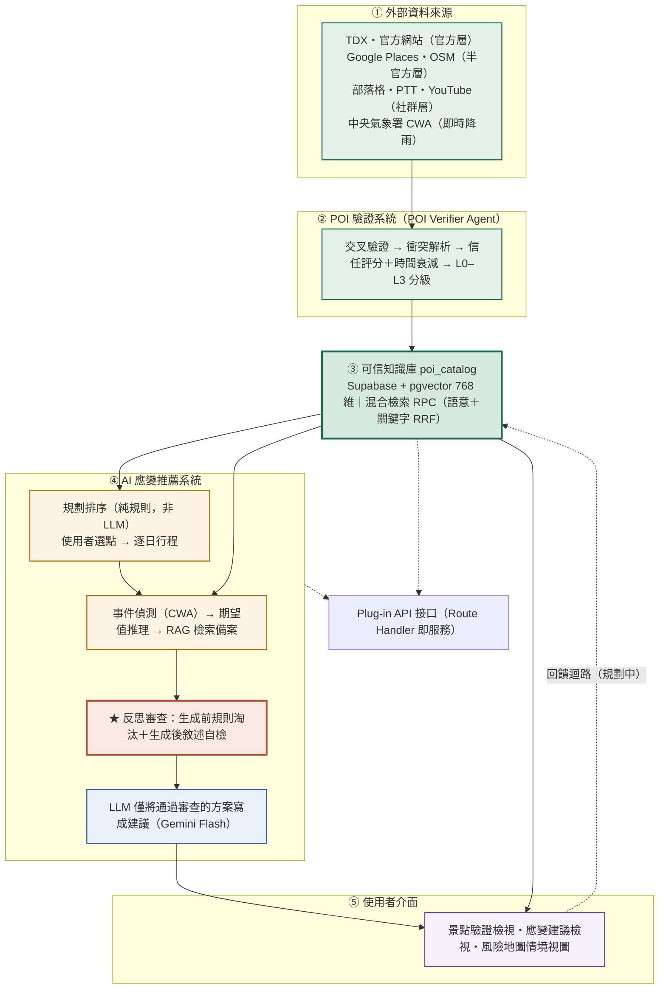
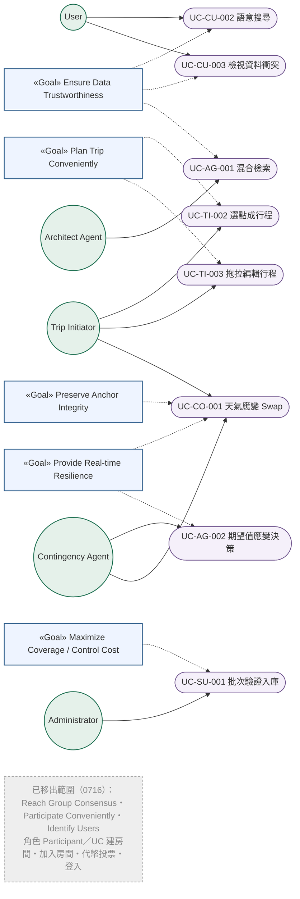

# 2026 年全國大專校院智慧創新暨跨域整合創作競賽

## Software Requirement Specification（系統需求書）

## 領航者 Navigator — 可信景點資料庫與即時韌性應變系統

> ⚠️ v0.3（2026-07-16）範圍縮減：多人規劃（房間／投票／共識收斂）與 Auth 登入移出本期範圍，相關需求以 ~~刪除線~~ 保留原編號註記，不重排。詳 `0716_減法決策與不做清單.md`。
>
> ⚠️ **「Architect Agent」為舊設計沿用的模組名稱，實際上不是 LLM agent。** 草案行程排序是純規則邏輯（區域分群＋最近鄰＋時間切天，`src/lib/draft-itinerary.ts`），沒有 LLM 呼叫；本文件內少數描述仍寫著「依投票結果」為 v0.2 遺留未同步，實際輸入已改為使用者自驗證庫選點（見 BFR7、UC-TI-002）。系統唯一的 LLM-driven agent 是 Contingency Handler。此份 SRS 的正式編號（BFR6/7、IIR4、角色矩陣等）暫不重新命名或重排，僅在此註記澄清，避免後續開發或 AI 協作誤將「Architect Agent」當成需要串接 LLM 的功能。詳見 `系統架構圖_競賽版.md`、`CLAUDE.md` §2。

---

> 撰寫格式參照台大軟體工程課程 SRS 範本（Meeting Scheduler）。
> 圖（系統架構圖、目標導向使用案例圖）暫以文字說明佔位，後續補繪。

---

## Revision History

| 版次 | 負責人 | 日期 | 變更項目敘述 | 審查者 | 審查日期 |
|---|---|---|---|---|---|
| 0.1 | — | 2026/07/15 | 建立 SRS 文件架構，依範本填入 Navigator 系統架構、功能／介面／非功能需求 | 全體組員 | — |
| 0.2 | — | 2026/07/15 | 新增目標導向使用案例、角色矩陣、追溯矩陣 | 全體組員 | — |
| 0.3 | — | 2026/07/16 | 範圍縮減：多人規劃（房間/投票）移出範圍（詳 `0716_減法決策與不做清單.md`），新增 FFR13 選點成行程；相關 FFR/UC 標註移除、不重排編號 | 全體組員 | — |
| 0.4 | — | 2026/07/21 | 補繪圖 1（系統架構圖）、圖 2（目標導向使用案例圖）Mermaid；一致化 §5.2 目標與 §5.4 角色矩陣殘留之多人／投票／登入項為移出範圍 | 全體組員 | — |

---

## 1. System Architecture（系統架構）

### 1.1 Introduction（簡介）

旅遊規劃的情境中，使用者面臨兩個真實痛點：

1. **網路景點資訊真假難辨**：部落格、社群、地圖上的資訊彼此衝突、品質不一，使用者難以判斷可信度；直接詢問一般 LLM 更可能得到幻覺答案。
2. **行程缺乏應變邏輯**：遇到天氣、交通、景點臨時關閉等突發狀況時，沒有系統化的備案思路，只能臨場慌亂重排。

觀察現有的旅遊規劃工具（TripAdvisor、Google Places、MindTrip 等），多聚焦於「景點推薦與資訊聚合」，鮮少有系統同時處理「資料可信度」與「行程進行中的即時韌性」。

本專案「領航者 Navigator」建立在一個**經多來源交叉驗證的可信景點知識庫**之上，強調兩件事：以多來源信度與衝突透明化建立**資料可信度**、以錨點分級（L0–L3）與事件觸發達成**即時韌性**。系統以涵蓋全台灣景點的廣度為核心差異化，用堪用且成本可控的 AI 技術（RAG 混合檢索、輕量 LLM），讓旅遊資訊「查得到、信得過、變得動」，並可以 Plug-in 服務形式串接既有旅遊平台。

本專案以 Next.js（App Router）建構前端與 BFF、以 Supabase（PostgreSQL + pgvector）為知識庫、以 Gemini 系列模型負責向量化與生成，並整合 TDX 觀光資料、中央氣象署開放資料等官方即時來源。

### 1.2 Architecture Expression（架構表達）

系統以 `poi_catalog`（可信景點知識庫）為全域樞紐，由 POI 驗證系統作為「生產者」寫入，由行程規劃與應變系統作為「消費者」讀出。主要模組如下：

| 模組 Module | 說明 Description |
|---|---|
| POI Verifier Agent（景點驗證代理） | 對外部來源資料進行清理標準化、多來源交叉驗證、衝突解析、信任評分、L0–L3 分級與 RAG 語意描述，輸出驗證後景點。 |
| Knowledge Base（知識庫模組） | `poi_catalog` 主知識庫，儲存事實欄位、metadata 與 768 維向量嵌入，提供 pgvector 混合檢索 RPC。 |
| Architect Agent（規劃代理，非 LLM，見上方註記） | 依使用者自驗證庫選點結果，透過漏斗式檢索（SQL 結構化過濾 + 語意向量）產出草案行程。**（v0.3：輸入由投票結果改為使用者選點）** |
| Contingency Handler Agent（應變處理代理） | 偵測天氣等事件，以期望值評估是否觸發應變，從知識庫撈出合格備案並產出 Swap／Switch 建議。 |
| ~~Trip Room Module（行程房間模組）~~ | ~~提供建立房間、多人加入、presence 管理。~~ **0716 移出範圍** |
| Exploration Module（景點探索模組） | 提供語意搜尋與資料可信度／衝突呈現（滑卡探索保留實作、非核心）。 |
| ~~Voting Module（投票模組）~~ | ~~提供代幣投票（VETO／MUST-GO／Like）與收斂結果。~~ **0716 移出範圍** |
| Itinerary Module（行程模組） | 提供使用者自驗證庫選點組成行程、行程檢視、拖拉編輯與地圖視覺化。 |
| ~~Authentication Module（身分驗證模組）~~ | ~~提供使用者註冊、登入與權限判定（Supabase Auth）。~~ **延後賽後** |
| Ingestion Pipeline（入庫管線） | 將驗證後景點向量化並 upsert 至 `poi_catalog`，含 TDX 批次匯入。 |

**圖 1：系統架構圖**（三層定位：資料層／推理層／LLM 層；詳版見 `系統架構圖_競賽版.md`）

> 資料流：外部資料來源 →（POI Verifier Agent）→ `poi_catalog` 知識庫 →（規劃排序／Contingency Handler Agent）→ 使用者介面；使用者回饋回流形成資料閉環。**關鍵主張：LLM 不做決策**，僅將已決定的方案轉為自然語言。

---

## 2. Functional Requirement（功能需求）

### 2.1 Front-end Functional Requirements（前端功能需求）

**~~Trip Room Module（行程房間模組）~~ — 0716 全模組移出範圍**

| 編號 | 名稱 | 描述 |
|---|---|---|
| ~~FFR1~~ | ~~Create Trip Room（建立行程房間）~~ | **0716 移出範圍**（多人規劃砍除，程式碼保留） |
| ~~FFR2~~ | ~~Join Trip Room（加入行程房間）~~ | **0716 移出範圍**（同上） |

**Exploration Module（景點探索模組）**

| 編號 | 名稱 | 描述 |
|---|---|---|
| FFR3 | Swipe to Explore POIs（滑卡探索景點） | 系統以 Tinder 式卡片呈現候選景點，使用者以左右滑動表達喜歡／略過。**（0716 註記：保留實作、非核心功能，不入競賽敘事）** |
| FFR4 | POI Semantic Search（景點語意搜尋） | 使用者輸入自然語言查詢（如「下雨天想找室內景點」），系統回傳經 RAG 混合檢索排序的景點結果，並附排序理由。 |
| FFR5 | View Reliability & Conflicts（檢視可信度與資料分歧） | 景點卡片顯示資料來源數與信任分數；若多來源資料不一致，顯示「資料分歧」徽章，詳情面板列出各來源版本、採用值與判定方式。 |

**~~Voting Module（投票模組）~~ — 0716 全模組移出範圍**

| 編號 | 名稱 | 描述 |
|---|---|---|
| ~~FFR6~~ | ~~Token Voting（代幣投票）~~ | **0716 移出範圍**（多人規劃砍除，程式碼保留） |
| ~~FFR7~~ | ~~View Voting Results（檢視收斂結果）~~ | **0716 移出範圍**（同上） |

**Itinerary Module（行程模組）**

| 編號 | 名稱 | 描述 |
|---|---|---|
| FFR8 | View Draft Itinerary（檢視行程） | 系統將使用者選定的景點組成逐日、逐時段行程呈現檢視。**（v0.3：行程來源由投票結果改為 FFR13 使用者選點）** |
| FFR9 | Drag-and-drop Edit Itinerary（拖拉編輯行程） | 使用者可拖拉調整景點順序、跨日搬移，支援觸控手勢，L0 絕對錨點不可被拖離其鎖定時段。 |
| FFR10 | Map Visualization（地圖視覺化） | 系統於地圖上顯示行程景點與當日路線，小螢幕支援地圖與卡片列 peek 並存。 |
| FFR13 | Build Itinerary from Verified POIs（自驗證庫選點成行程）**（v0.3 新增）** | 使用者於驗證景點庫瀏覽時，可將景點加入行程；系統依地理鄰近與停留時間簡單排序，組成天氣應變的作用對象行程。 |

**Contingency Module（應變模組）**

| 編號 | 名稱 | 描述 |
|---|---|---|
| FFR11 | Weather Contingency Suggestion（天氣應變建議） | 當偵測到當日高降雨機率影響戶外景點時，系統主動提示，並提供同區室內備案的 Swap 建議，附替換理由與信度。 |
| FFR12 | Accept / Reject Swap（接受／拒絕應變建議） | 使用者可選擇接受某個備案以替換原景點（系統更新行程並重算路線），或拒絕保留原行程。 |

### 2.2 Back-end Functional Requirements（後端功能需求）

**POI Verification Module（景點驗證模組）**

| 編號 | 名稱 | 描述 |
|---|---|---|
| BFR1 | Multi-source POI Verification（多來源景點驗證） | 對每筆景點交叉比對 TDX、Google Places、OSM、官方網站、部落格、PTT、YouTube 等來源，確認存在性並計算來源信度。 |
| BFR2 | Conflict Resolution（衝突解析） | 對名稱／地址／營業時間／是否營業等欄位，以兩步驟規則處理來源衝突：能澄清（依可信度層級或時效）則採可信版本，否則多版本並存並標記 `is_conflicted`。 |
| BFR3 | Resilience Classification & Enrichment（韌性分級與加值） | 為每筆景點標定 L0–L3 韌性等級、室內外、天氣敏感度、備案策略與決策標籤，缺值時給合理預設。 |

**Knowledge Base Module（知識庫模組）**

| 編號 | 名稱 | 描述 |
|---|---|---|
| BFR4 | Embedding & Ingestion（向量化入庫） | 將驗證後景點組成語意字串，經 Gemini 產生 768 維向量，連同事實欄位與 metadata upsert 至 `poi_catalog`。 |
| BFR5 | Hybrid Search（混合檢索） | 提供 `hybrid_search_poi_catalog` RPC，結合 pgvector 語意向量與 pg_trgm／全文關鍵字，以 RRF 排名融合回傳候選。 |

**Architect Agent Module（規劃代理模組；非 LLM agent，純規則排序，見文首註記）**

| 編號 | 名稱 | 描述 |
|---|---|---|
| BFR6 | Funnel Retrieval（漏斗式檢索） | 依區域、室內外、營業時段等結構化條件先過濾，再以語意向量補足 vibe，最後依 Level 重排，壓低 Token 成本。 |
| BFR7 | Draft Itinerary Generation（草案行程生成） | 依使用者選定的景點（FFR13），考量停留時間與景點間距，產生逐日行程骨架。**（v0.3：輸入由投票收斂結果改為使用者選點）** |

**Contingency Handler Module（應變處理模組）**

| 編號 | 名稱 | 描述 |
|---|---|---|
| BFR8 | Event Detection（事件偵測） | 以中央氣象署資料偵測行程日的降雨機率等天氣事件，作為應變觸發器。 |
| BFR9 | Expected Value Evaluation（期望值評估） | 以 EV = P_晴 × L + P_雨 × (L × α) 計算景點期望值，當分數落差超過門檻即判定應觸發應變。 |
| BFR10 | Swap / Switch Decision（替換／切換決策） | 觸發後從知識庫撈出合格備案，於同層級內替換（Swap）或切換整段行程型態（Switch），L0 禁止自動替換。 |

---

## 3. Interface Requirement（介面需求）

### 3.1 External Interface Requirements（外部介面需求）

| 編號 | 名稱 | 描述 |
|---|---|---|
| EIR1 | TDX 觀光 API | 系統向交通部 TDX 運輸資料流通服務查詢官方景點／餐飲／旅宿資料，作為驗證的官方層來源與擴充景點量的主力。 |
| EIR2 | Google Places API | 系統查詢 Google Places 取得景點座標、評分、評論數，作為半官方層來源與可信度訊號。 |
| EIR3 | 中央氣象署 CWA 開放資料 API | 系統向 CWA 查詢鄉鎮天氣預報與降雨機率，作為應變模組的天氣事件觸發資料。 |
| EIR4 | Gemini Embedding / LLM API | 系統呼叫 Gemini 產生 768 維向量嵌入（RETRIEVAL_DOCUMENT／RETRIEVAL_QUERY）與生成式輸出（洞察萃取、排序理由）。 |
| EIR5 | Map Service（Mapbox / Leaflet） | 系統透過地圖服務渲染景點標記與路線。 |
| ~~EIR6~~ | ~~User Authentication（Supabase Auth）~~ | **0716 延後賽後**（demo 不需登入） |

### 3.2 Internal Interface Requirements（內部介面需求）

| 編號 | 名稱 | 描述 |
|---|---|---|
| IIR1 | Verifier Agent 與 Knowledge Base | 驗證代理將驗證後的事實欄位、metadata 與向量透過入庫管線 upsert 至 `poi_catalog`。 |
| IIR2 | Exploration Module 與 Knowledge Base | 探索模組透過 `/api/poi/search` Route Handler 呼叫混合檢索 RPC，取得候選景點與可信度資訊。 |
| ~~IIR3~~ | ~~Voting Module 與 Database~~ | **0716 移出範圍**（投票模組砍除） |
| IIR4 | Architect Agent 與 Knowledge Base | 規劃代理以漏斗式檢索從 `poi_catalog` 撈取候選池，產生草案行程並寫回行程資料表。 |
| IIR5 | Contingency Handler 與 Knowledge Base | 應變代理以語意查詢從 `poi_catalog` 撈取合格備案池，供期望值評估與排序使用。 |
| IIR6 | Contingency Handler 與 Itinerary Module | 應變代理將 Swap／Switch 建議推回行程模組，使用者確認後更新行程並重算路線。 |
| ~~IIR7~~ | ~~Authentication Module 與 Trip Room Module~~ | **0716 移出範圍**（Auth 延後、房間模組砍除） |
| IIR8 | Route Handler 與外部 API | BFF（Next.js Route Handler）代為呼叫 Gemini／CWA／TDX 等外部 API，API 金鑰僅存於伺服器端。 |

---

## 4. Nonfunctional Requirement（非功能需求）

| 編號 | 名稱 | 描述 |
|---|---|---|
| NFR1 | Cost Efficiency（成本效率） | 單次語意檢索的 LLM／Embedding 成本應控制在合理範圍（目標 < 每次新台幣 5 元），透過漏斗式檢索與輕量模型達成。 |
| NFR2 | Mobile-first（行動優先） | 系統以手機視窗（< 640px）為 baseline 設計，桌面為增強；卡片可觸控目標 ≥ 44×44pt，滑卡與拖拉皆支援觸控手勢。 |
| NFR3 | Retrieval Performance（檢索效能） | 混合檢索應在合理秒數內回應；`poi_catalog` 使用 pgvector HNSW 索引與 GIN／trigram 索引以維持查詢效能。 |
| NFR4 | Trust Transparency（可信度透明） | 系統須將資料來源數、最後驗證時間與來源分歧狀態呈現給使用者，讓可信度成為可見的價值，而非隱藏的內部機制。 |
| NFR5 | Data Freshness（資料時效） | 來源資料採時間衰減信度，容易過期的欄位（如營業時間）衰減較快；規劃排程再驗證機制標記過期資料。 |
| NFR6 | Security（安全性） | 所有外部 AI／資料 API 金鑰僅存於伺服器端，前端不得直接呼叫；使用者資料受列級安全（RLS）保護。 |
| NFR7 | Scalability（可擴充性） | 知識庫須能自 demo 階段的數十筆擴充至涵蓋全台灣景點（數萬筆），pgvector 於此規模仍可維持效能。 |
| NFR8 | Resilience Integrity（韌性完整性） | L0 絕對錨點（如已預訂餐廳）在任何自動流程中禁止被替換或移動，系統須強制此約束。 |

---

## 5. Goal-driven Use Case Diagram（目標導向使用案例）

### 5.1 Introduction to Goal-driven Approach（目標導向方法簡介）

本專案採用目標導向（Goal-Driven）方式表達使用案例，以強化呈現系統欲達成的目標、非功能需求，以及與使用案例的相依關係。每個目標從三個層面分析：

- **能力面（Capability）**：判斷目標是否必須被完全滿足，分為強制性（Rigid）與非強制性（Soft）。
- **觀點面（Perspective）**：判斷目標以角色觀點描述（Actor-Specific）或與系統相關（System-Specific）。
- **內容面（Content）**：判斷目標為系統定義之功能（Functional）或非功能（Nonfunctional）。

### 5.2 Objective Statement（目標敘述）

| 目標名稱 | 目標屬性 | 目標描述 |
|---|---|---|
| Ensure Data Trustworthiness（確保資料可信） | (R,Y,F) | 讓進入行程的每個景點皆經多來源交叉驗證，並透明呈現可信度與資料分歧。 |
| Provide Real-time Resilience（提供即時韌性） | (R,Y,F) | 讓行程在天氣等突發事件下能即時提出合格備案，維持行程可行性。 |
| Maximize Coverage（最大化景點涵蓋） | (S,Y,N) | 以堪用技術涵蓋全台灣景點，讓廣度成為核心差異化優勢。 |
| Control Cost（控制成本） | (S,Y,N) | 使單次檢索成本維持在可負擔範圍，讓系統可規模化運行。 |
| Preserve Anchor Integrity（維護錨點完整） | (R,Y,F) | 確保 L0 絕對錨點不被自動流程更動。 |
| Plan Trip Conveniently（便利規劃行程） | (R,A,F) | 讓使用者便利地自驗證庫選點、產生草案並編輯行程。**（v0.3：原「建立房間」語意隨房間模組移出而修改）** |
| Manage Knowledge Base Conveniently（便利管理知識庫） | (S,A,F) | 讓管理員便利地批次驗證景點並維護知識庫。 |
| ~~Reach Group Consensus（達成群體共識）~~ | ~~(R,A,F)~~ | **0716 移出範圍**（代幣投票／多人收斂砍除）。 |
| ~~Participate Conveniently（便利參與）~~ | ~~(R,A,F)~~ | **0716 移出範圍**（參與者加入房間／投票砍除）。 |
| ~~Identify Users（識別使用者）~~ | ~~(R,A,F)~~ | **延後賽後**（Supabase Auth 登入延後，demo 不需登入）。 |

**表 1：目標屬性說明**

| 屬性 | 說明 | 屬性 | 說明 |
|---|---|---|---|
| R | Rigid（強制性） | S | Soft（非強制性） |
| A | Actor-Specific（角色相關） | Y | System-Specific（系統相關） |
| F | Functional（功能性） | N | Nonfunctional（非功能性） |

### 5.3 Goal-driven Use Case Diagram（目標導向使用案例圖）

**圖 2：目標導向使用案例圖**（0716 對齊版；灰底目標與角色為已移出範圍，保留供對照）

> «Goal» 目標套件以虛線 Achieve 連接使用案例（橢圓）與角色（Actor）。灰色框列出 0716 移出範圍之目標／角色／使用案例，僅供對照，不具效力。

### 5.4 Actor Description and Actor Use Case Matrix（角色描述與角色使用案例矩陣）

**表 2：角色描述表**

| 角色 Actor | 描述 Description |
|---|---|
| User（使用者） | 使用 Navigator 的一般使用者，可探索景點、語意搜尋、檢視可信度。 |
| Trip Initiator（行程擁有者） | 自驗證庫選點組成行程、編輯行程、確認應變建議的使用者。**（v0.3：原「房主」定義隨房間模組移出而修改）** |
| ~~Participant（參與者）~~ | ~~受邀加入行程房間、滑卡探索並投票的成員。~~ **0716 移出範圍** |
| Administrator（系統管理員） | 維護 `poi_catalog` 知識庫，執行批次驗證與入庫的管理者。 |
| Architect Agent（規劃代理，非 LLM，見上方註記） | 依使用者選點結果產生草案行程的系統角色。**（v0.3：改為使用者選點，非投票結果）** |
| Contingency Handler Agent（應變代理） | 偵測事件並產生應變建議的系統角色。 |

**表 3：角色使用案例矩陣**

> 註：`Participant` 欄與 `UC-CU-004 登入系統` 已於 0716 移出／延後，保留列供對照（標記為移出），不再具效力。

| 使用案例 | User | ~~Participant~~ | Trip Initiator | Administrator | Architect Agent | Contingency Agent |
|---|:---:|:---:|:---:|:---:|:---:|:---:|
| UC-CU-001 滑卡探索景點（保留、非核心） | V | — | V | | | |
| UC-CU-002 景點語意搜尋 | V | — | V | | | |
| UC-CU-003 檢視資料衝突 | V | — | V | | | |
| ~~UC-CU-004 登入系統~~ **延後賽後** | — | — | | | | |
| ~~UC-TI-001 建立行程房間~~ **0716 移出** | | | | | | |
| UC-TI-002 選點成行程（v0.3 改寫） | | | V | | V | |
| UC-TI-003 拖拉編輯行程 | | | V | | | |
| ~~UC-PT-001 加入行程房間~~ **0716 移出** | | | | | | |
| ~~UC-PT-002 代幣投票~~ **0716 移出** | | | | | | |
| UC-CO-001 天氣應變 Swap | | | V | | | V |
| UC-SU-001 POI 批次驗證入庫 | | | | V | | |
| UC-AG-001 混合檢索 | | | | | V | V |
| UC-AG-002 期望值應變決策 | | | | | | V |

### 5.5 Use Case Specification（使用案例規格）

---

**UC-CU-001**

| 欄位 | 內容 |
|---|---|
| Use Case ID | UC-CU-001 |
| Use Case Name | Swipe to Explore POIs（滑卡探索景點） |
| Goal | Achieve "Participate Conveniently" |
| Requirement | [FFR3: Swipe to Explore POIs]、[BFR5: Hybrid Search] |
| Description | 使用者以 Tinder 式卡片滑動方式瀏覽候選景點並表達偏好。 |
| Actor | User、Participant |
| Priority | High |
| Pre-Conditions | 1. 使用者已登入系統　2. 系統已有可供探索的候選景點 |
| Post-Conditions | 系統記錄使用者對各景點的喜歡／略過偏好 |
| Basic Flow | 1. 使用者進入探索頁 2. 系統顯示一張候選景點卡片（含圖片、名稱、地區、Level、可信度） 3. 使用者向右滑表示喜歡，或向左滑表示略過 4. 系統記錄偏好並顯示下一張卡片 5. 重複 2–4 直到候選卡片結束 |
| Alternative Flows | 3.1 使用者點按「喜歡／略過」按鈕，效果同滑動 |
| Exceptional Flows | 2.1 若候選景點已全部瀏覽完畢，系統顯示「已看完」並提示前往投票 |
| Extend Use Case | [UC-CU-002: POI 語意搜尋] |
| Artifacts | 使用者偏好紀錄 |
| Use Case Glossary | 偏好紀錄 = 使用者 ID + 景點 ID + 偏好（喜歡／略過）+ 時間 |

---

**UC-CU-002**

| 欄位 | 內容 |
|---|---|
| Use Case ID | UC-CU-002 |
| Use Case Name | POI Semantic Search（景點語意搜尋） |
| Goal | Achieve "Ensure Data Trustworthiness" |
| Requirement | [FFR4: POI Semantic Search]、[BFR5: Hybrid Search]、[BFR6: Funnel Retrieval] |
| Description | 使用者以自然語言查詢景點，系統以 RAG 混合檢索回傳排序結果與理由。 |
| Actor | User、Participant |
| Priority | High |
| Pre-Conditions | 1. 使用者已登入　2. 知識庫已有向量化的景點資料 |
| Post-Conditions | 系統回傳經混合檢索與重排的景點清單，附可信度與排序理由 |
| Basic Flow | 1. 使用者輸入自然語言查詢（如「下雨天想找室內景點」） 2. 系統於伺服器端將查詢轉為 768 維向量（RETRIEVAL_QUERY） 3. 系統呼叫混合檢索 RPC（語意向量 + 關鍵字，RRF 融合） 4. 系統以結構化條件與情境（如雨天）進行重排（Structural Boost） 5. 系統回傳 Top-N 景點，附信任分數、來源與排序理由 |
| Alternative Flows | 1.1 使用者附加篩選條件（地區／室內外／Level），系統加入 metadata 過濾 |
| Exceptional Flows | 3.1 若無任何結果達門檻，系統顯示「查無符合條件的景點」並建議放寬條件 |
| Use Use Case | [UC-AG-001: 混合檢索] |
| Artifacts | 檢索結果清單 |
| Use Case Glossary | 檢索結果 = 景點 ID + 名稱 + 混合分數 + 信任分數 + 來源清單 + 排序理由 |

---

**UC-CU-003**

| 欄位 | 內容 |
|---|---|
| Use Case ID | UC-CU-003 |
| Use Case Name | View Data Conflicts（檢視資料衝突） |
| Goal | Achieve "Ensure Data Trustworthiness" |
| Requirement | [FFR5: View Reliability & Conflicts]、[BFR2: Conflict Resolution] |
| Description | 使用者檢視某景點的多來源資料分歧，了解採用值與判定依據。 |
| Actor | User、Participant |
| Priority | Medium |
| Pre-Conditions | 該景點已完成多來源驗證，且存在 `is_conflicted` 標記 |
| Post-Conditions | 使用者了解該景點各欄位的採用值、判定方式與各來源原始值 |
| Basic Flow | 1. 使用者於景點卡片看到「資料分歧」徽章 2. 使用者點按進入詳情面板 3. 系統列出每個衝突欄位的最終採用值 4. 系統顯示判定方式（單一來源／來源一致／依層級澄清／依時效澄清／並存） 5. 系統列出各來源原始值與來源層級（官方／半官方／部落格／使用者回報） |
| Alternative Flows | — |
| Exceptional Flows | 1.1 若景點各來源一致無衝突，則不顯示徽章，本案例不觸發 |
| Artifacts | 衝突分析紀錄 ConflictAnalysis |
| Use Case Glossary | 衝突紀錄 = 欄位 + 採用值 + 判定方式 + is_conflicted + 各來源版本[來源, 值, 層級, 時間] |

---

**UC-CU-004**

| 欄位 | 內容 |
|---|---|
| Use Case ID | UC-CU-004 |
| Use Case Name | Login to the System（登入系統） |
| Goal | Achieve "Identify Users" |
| Requirement | [EIR6: User Authentication] |
| Description | 使用者登入系統以使用需身分的功能。 |
| Actor | User |
| Priority | High |
| Pre-Conditions | 使用者尚未登入 |
| Post-Conditions | 使用者成功登入並取得對應權限 |
| Basic Flow | 1. 使用者輸入帳號密碼或選擇第三方登入 2. 系統透過 Supabase Auth 驗證身分 3. 驗證通過，導向使用者的主畫面 |
| Alternative Flows | 2.1 第三方登入（如 Google）由外部提供者驗證後回傳 |
| Exceptional Flows | 2.2 若帳密錯誤或未註冊，顯示錯誤訊息並停留於登入頁 |
| Artifacts | 登入憑證 |
| Use Case Glossary | 登入憑證 = 帳號 + 密碼（或第三方 token） |

---

**~~UC-TI-001~~ — ❌ 0716 移出範圍（多人規劃砍除，保留原文供對照）**

| 欄位 | 內容 |
|---|---|
| Use Case ID | ~~UC-TI-001~~（0716 移出範圍） |
| Use Case Name | ~~Create Trip Room（建立行程房間）~~ |
| Goal | Achieve "Plan Trip Conveniently" |
| Requirement | [FFR1: Create Trip Room] |
| Description | 發起人建立行程房間並產生可分享的加入方式。 |
| Actor | Trip Initiator |
| Priority | High |
| Pre-Conditions | 使用者已登入系統 |
| Post-Conditions | 系統建立行程房間並產生加入連結／代碼，發起人成為房主 |
| Basic Flow | 1. 發起人點選「建立行程」 2. 發起人填寫行程名稱、目的地區域、日期範圍 3. 發起人點選確定 4. 系統建立房間並產生加入連結／代碼 5. 系統將發起人設為房主並進入房間 |
| Alternative Flows | 2.1 發起人未填目的地，系統預設為熱門區域候選 |
| Exceptional Flows | 3.1 若行程名稱或日期為空，系統顯示警告要求補齊 |
| Extend Use Case | [UC-TI-002: 產生草案行程] |
| Artifacts | 行程房間 |
| Use Case Glossary | 行程房間 = 房間 ID + 名稱 + 區域 + 日期範圍 + 房主 ID + 加入代碼 |

---

**UC-TI-002**

| 欄位 | 內容 |
|---|---|
| Use Case ID | UC-TI-002（v0.3 改寫：投票輸入 → 使用者選點） |
| Use Case Name | Build Itinerary from Selected POIs（選點成行程） |
| Goal | Achieve "Plan Trip Conveniently" |
| Requirement | [FFR8: View Draft Itinerary]、[FFR13: Build Itinerary from Verified POIs]、[BFR6: Funnel Retrieval]、[BFR7: Draft Itinerary Generation] |
| Description | 使用者自驗證庫選定景點後，系統自動組成逐日行程。 |
| Actor | Trip Initiator（行程擁有者）、Architect Agent |
| Priority | High |
| Pre-Conditions | 1. 使用者已自驗證庫選定至少一個景點（FFR13）　2. 知識庫有足夠候選景點 |
| Post-Conditions | 系統產生逐日、逐時段的行程供檢視 |
| Basic Flow | 1. 使用者於驗證庫將景點加入行程 2. 使用者點選「組成行程」 3. 系統依地理鄰近、停留時間與景點間距安排時段 4. 系統產生逐日行程並顯示於行程頁 |
| Alternative Flows | 3.1 若選定景點不足以填滿日程，系統以 L3 水位調節景點建議補足 buffer |
| Exceptional Flows | 2.1 若尚未選定任何景點，系統提示先於驗證庫選點 |
| Use Use Case | [UC-AG-001: 混合檢索] |
| Extend Use Case | — |
| Artifacts | 草案行程 |
| Use Case Glossary | 草案行程 = 行程 ID + [日 → [時段 → 景點 ID + Level + 停留分鐘]] |

---

**UC-TI-003**

| 欄位 | 內容 |
|---|---|
| Use Case ID | UC-TI-003 |
| Use Case Name | Drag-and-drop Edit Itinerary（拖拉編輯行程） |
| Goal | Achieve "Plan Trip Conveniently" |
| Requirement | [FFR9: Drag-and-drop Edit Itinerary]、[FFR10: Map Visualization]、[NFR8: Resilience Integrity] |
| Description | 使用者以拖拉方式調整行程景點順序與日程分配。 |
| Actor | Trip Initiator |
| Priority | Medium |
| Pre-Conditions | 已存在草案行程 |
| Post-Conditions | 系統更新行程順序並重算當日路線 |
| Basic Flow | 1. 使用者拖拉某景點卡片至新位置 2. 系統更新該景點在行程中的順序／日程 3. 系統重算當日路線並更新地圖 |
| Alternative Flows | 1.1 使用者跨日搬移景點，系統更新兩日的時段安排 |
| Exceptional Flows | 1.2 若使用者嘗試移動 L0 絕對錨點離開其鎖定時段，系統阻止並提示該景點不可更動 |
| Artifacts | 更新後行程 |
| Use Case Glossary | — |

---

**~~UC-PT-001~~ — ❌ 0716 移出範圍（多人規劃砍除，保留原文供對照）**

| 欄位 | 內容 |
|---|---|
| Use Case ID | ~~UC-PT-001~~（0716 移出範圍） |
| Use Case Name | ~~Join Trip Room（加入行程房間）~~ |
| Goal | Achieve "Participate Conveniently" |
| Requirement | [FFR2: Join Trip Room] |
| Description | 參與者透過連結或代碼加入既有行程房間。 |
| Actor | Participant |
| Priority | High |
| Pre-Conditions | 1. 使用者已登入　2. 行程房間存在且開放加入 |
| Post-Conditions | 使用者成為該房間參與者，可見房間內容與其他成員狀態 |
| Basic Flow | 1. 使用者開啟加入連結或輸入代碼 2. 系統驗證房間有效性 3. 系統將使用者加入房間並顯示成員即時狀態 |
| Alternative Flows | — |
| Exceptional Flows | 2.1 若代碼無效或房間已關閉，系統顯示錯誤並中止加入 |
| Artifacts | 房間成員資格 |
| Use Case Glossary | 成員資格 = 房間 ID + 使用者 ID + 加入時間 |

---

**~~UC-PT-002~~ — ❌ 0716 移出範圍（多人規劃砍除，保留原文供對照）**

| 欄位 | 內容 |
|---|---|
| Use Case ID | ~~UC-PT-002~~（0716 移出範圍） |
| Use Case Name | ~~Token Voting（代幣投票）~~ |
| Goal | Achieve "Reach Group Consensus" |
| Requirement | [FFR6: Token Voting]、[FFR7: View Voting Results] |
| Description | 參與者以固定代幣對候選景點投票，系統依權重收斂群體共識。 |
| Actor | Participant、Trip Initiator |
| Priority | High |
| Pre-Conditions | 1. 使用者為房間參與者　2. 房間已有候選景點 |
| Post-Conditions | 系統依 Σ(票 × 權重) 更新候選景點排名，VETO 者出局 |
| Basic Flow | 1. 系統顯示候選景點與使用者剩餘代幣（1 VETO、2 MUST-GO、無限 Like） 2. 使用者對某景點投下 Like（+1） 3. 使用者對重要景點投下 MUST-GO（+5） 4. 使用者對不想去的景點投下 VETO 5. 系統即時更新排名並同步給房間成員 |
| Alternative Flows | 2.1 使用者收回先前投的票，系統退還對應代幣並重算 |
| Exceptional Flows | 3.1 若 MUST-GO 代幣已用完，系統禁止再投並提示 4.1 VETO 為硬否決（權重 −∞），該景點直接出局，不作為加權負票處理 |
| Artifacts | 投票紀錄 |
| Use Case Glossary | 投票紀錄 = 房間 ID + 使用者 ID + 景點 ID + 票種（VETO／MUST-GO／Like） |

---

**UC-CO-001**

| 欄位 | 內容 |
|---|---|
| Use Case ID | UC-CO-001 |
| Use Case Name | Weather Contingency Swap（天氣應變替換） |
| Goal | Achieve "Provide Real-time Resilience" |
| Requirement | [FFR11: Weather Contingency Suggestion]、[FFR12: Accept/Reject Swap]、[BFR8]、[BFR9]、[BFR10] |
| Description | 當偵測到高降雨機率影響戶外景點時，系統提出同區室內備案供使用者替換。 |
| Actor | Trip Initiator、Contingency Handler Agent |
| Priority | High |
| Pre-Conditions | 1. 已存在行程　2. 行程中含天氣敏感的戶外景點 |
| Post-Conditions | 系統提出 Swap 建議；使用者接受則更新行程，拒絕則保留原行程 |
| Basic Flow | 1. 應變代理以 CWA 資料偵測行程日降雨機率 2. 代理以期望值 EV = P_晴 × L + P_雨 × (L × α) 評估景點 3. 若分數落差超過門檻，判定應觸發應變 4. 代理從知識庫撈出同區室內備案並排序 5. 系統向使用者顯示 Swap 建議（原景點 vs 備案、分數落差、理由、信度） 6. 使用者接受某備案 7. 系統以備案替換原景點並重算路線 |
| Alternative Flows | 6.1 使用者拒絕所有建議，系統保留原行程並記錄 |
| Exceptional Flows | 2.1 若受影響景點為 L0 絕對錨點，系統禁止自動替換，僅提示風險 3.1 若分數落差未達門檻，系統不觸發應變 |
| Use Use Case | [UC-AG-002: 期望值應變決策]、[UC-AG-001: 混合檢索] |
| Artifacts | 應變建議 ContingencyPlan |
| Use Case Glossary | 應變建議 = 原景點 + 備案清單[景點, 分數, 理由, 信度] + 決策型態（Swap／Switch） |

---

**UC-SU-001**

| 欄位 | 內容 |
|---|---|
| Use Case ID | UC-SU-001 |
| Use Case Name | Batch Verify & Ingest POIs（POI 批次驗證入庫） |
| Goal | Achieve "Manage Knowledge Base Conveniently" |
| Requirement | [BFR1]、[BFR2]、[BFR3]、[BFR4]、[EIR1]、[EIR2] |
| Description | 管理員對一批景點執行多來源驗證、衝突解析、分級與向量化入庫。 |
| Actor | Administrator |
| Priority | High |
| Pre-Conditions | 1. 管理員具入庫權限　2. 外部來源 API（TDX／Google 等）可用 |
| Post-Conditions | 驗證後景點連同事實欄位、metadata 與向量寫入 `poi_catalog` |
| Basic Flow | 1. 管理員指定景點來源與範圍（如某縣市 TDX 資料） 2. 系統對每筆景點交叉比對多來源並計算信度 3. 系統執行衝突解析並標記分歧欄位 4. 系統標定 L0–L3 分級、室內外、天氣敏感度與備案策略 5. 系統產生 768 維向量並 upsert 至 `poi_catalog` 6. 系統回報成功筆數與成功率 |
| Alternative Flows | 5.1 同一 source_id 已存在時，以確定性 UUID 覆寫更新，不重複建立 |
| Exceptional Flows | 2.1 若某景點僅單一來源可證存在性，標記較低信度並保留待再驗 5.2 若 Embedding API 達速率上限，系統重試並延遲後續批次 |
| Artifacts | 入庫紀錄 |
| Use Case Glossary | 入庫紀錄 = 景點 ID + source_id + 向量維度 + 成功／失敗 |

---

**UC-AG-001**

| 欄位 | 內容 |
|---|---|
| Use Case ID | UC-AG-001 |
| Use Case Name | Hybrid Search（混合檢索） |
| Goal | Achieve "Ensure Data Trustworthiness" / "Control Cost" |
| Requirement | [BFR5: Hybrid Search] |
| Description | 系統以語意向量與關鍵字雙路檢索並以 RRF 融合，回傳候選景點。 |
| Actor | Architect Agent、Contingency Handler Agent |
| Priority | High |
| Pre-Conditions | 知識庫已有向量化景點與檢索索引 |
| Post-Conditions | 系統回傳融合排序後的候選景點清單 |
| Basic Flow | 1. 系統以查詢向量進行 pgvector 語意檢索（取 2× 需求量作為 RRF headroom） 2. 系統以 pg_trgm 與全文檢索進行關鍵字檢索 3. 系統以 RRF（hybrid = α × 1/(k+向量名次) + (1−α) × 1/(k+關鍵字名次)）融合兩路排名 4. 系統回傳融合分數最高的 N 筆 |
| Alternative Flows | 3.1 依查詢型態調整 α：命中景點名稱時偏關鍵字（α≈0.3），純 vibe 描述時偏語意（α≈0.7） |
| Exceptional Flows | 1.1 套用 metadata 過濾條件後若候選過少，放寬門檻重查 |
| Artifacts | 融合檢索結果 |
| Use Case Glossary | 融合結果 = 景點 ID + 向量名次 + 關鍵字名次 + hybrid_score |

---

**UC-AG-002**

| 欄位 | 內容 |
|---|---|
| Use Case ID | UC-AG-002 |
| Use Case Name | Expected Value Contingency Decision（期望值應變決策） |
| Goal | Achieve "Provide Real-time Resilience" |
| Requirement | [BFR9: Expected Value Evaluation]、[BFR10: Swap/Switch Decision]、[NFR8] |
| Description | 系統以期望值模型判斷是否觸發應變，並決定 Swap 或 Switch。 |
| Actor | Contingency Handler Agent |
| Priority | High |
| Pre-Conditions | 已取得天氣事件資料與行程中景點的 Level、室內外屬性 |
| Post-Conditions | 系統輸出是否觸發應變與建議的決策型態 |
| Basic Flow | 1. 系統取得景點 Level 分數 L 與天氣影響因子 α（室內 0.95／半 0.50／戶外 0.10） 2. 系統計算 EV = P_晴 × L + P_雨 × (L × α) 3. 系統計算分數落差 drop = L − EV 4. 若 drop > 門檻，判定應觸發應變 5. 系統依情境決定同層級替換（Swap）或整段切換（Switch）|
| Alternative Flows | 5.1 若同區找不到合格同級室內備案，改建議 Switch（整段時段後延／改型態） |
| Exceptional Flows | 1.1 若景點為 L0，直接排除自動替換，僅輸出風險提示 2.1 若天氣資料來源為 mock，降低決策信心（confidence 0.6 vs 真實 0.9） |
| Artifacts | 期望值評估結果 |
| Use Case Glossary | EV 結果 = 原分數 L + 期望值 EV + 分數落差 drop + 是否觸發 + 信心值 |

---

## 6. Traceability Matrix（追溯矩陣）

> **v0.3 註**：FFR1/2/6/7、EIR6、IIR3/7 及 UC-TI-001、UC-PT-001、UC-PT-002 已於 0716 移出範圍；下方矩陣保留原編號供對照，對應列不再具效力。

### 6.1 Traceability Matrix of Requirements V.S Use Case（需求對使用案例）

| 需求 \ 使用案例 | CU-001 | CU-002 | CU-003 | CU-004 | TI-001 | TI-002 | TI-003 | PT-001 | PT-002 | CO-001 | SU-001 | AG-001 | AG-002 |
|---|:-:|:-:|:-:|:-:|:-:|:-:|:-:|:-:|:-:|:-:|:-:|:-:|:-:|
| FFR1 | | | | | v | | | | | | | | |
| FFR2 | | | | | | | | v | | | | | |
| FFR3 | v | | | | | | | | | | | | |
| FFR4 | | v | | | | | | | | | | | |
| FFR5 | | | v | | | | | | | | | | |
| FFR6 | | | | | | | | | v | | | | |
| FFR7 | | | | | | | | | v | | | | |
| FFR8 | | | | | | v | | | | | | | |
| FFR9 | | | | | | | v | | | | | | |
| FFR10 | | | | | | | v | | | v | | | |
| FFR11 | | | | | | | | | | v | | | |
| FFR12 | | | | | | | | | | v | | | |
| BFR1 | | | | | | | | | | | v | | |
| BFR2 | | | v | | | | | | | | v | | |
| BFR3 | | | | | | | | | | | v | | |
| BFR4 | | | | | | | | | | | v | | |
| BFR5 | v | v | | | | v | | | | v | | v | |
| BFR6 | | v | | | | v | | | | | | | |
| BFR7 | | | | | | v | | | | | | | |
| BFR8 | | | | | | | | | | v | | | |
| BFR9 | | | | | | | | | | v | | | v |
| BFR10 | | | | | | | | | | v | | | v |

### 6.2 Traceability Matrix of Requirements V.S Interface（需求對介面）

| 需求 \ 介面 | EIR1 | EIR2 | EIR3 | EIR4 | EIR5 | EIR6 | IIR1 | IIR2 | IIR3 | IIR4 | IIR5 | IIR6 | IIR7 | IIR8 |
|---|:-:|:-:|:-:|:-:|:-:|:-:|:-:|:-:|:-:|:-:|:-:|:-:|:-:|:-:|
| FFR1 | | | | | | | | | | | | | v | |
| FFR2 | | | | | | | | | | | | | v | |
| FFR4 | | | | v | | | | v | | | | | | v |
| FFR5 | | | | | | | | v | | | | | | |
| FFR6 | | | | | | | | | v | | | | | |
| FFR10 | | | | | v | | | | | | | | | |
| FFR11 | | | v | | | | | | | | v | v | | v |
| BFR1 | v | v | | | | | v | | | | | | | |
| BFR4 | | | | v | | | v | | | | | | | |
| BFR5 | | | | v | | | | v | | v | v | | | v |
| BFR7 | | | | | | | | | | v | | | | |
| BFR8 | | | v | | | | | | | | | | | v |
| BFR10 | | | | | | | | | | | v | v | | |

### 6.3 Traceability Matrix of Requirements V.S Subsystem（需求對子系統）

| 需求 \ 子系統 | 驗證代理 | 知識庫 | 規劃代理 | 應變代理 | 行程房間 | 探索 | 投票 | 行程 | 身分驗證 | 入庫管線 |
|---|:-:|:-:|:-:|:-:|:-:|:-:|:-:|:-:|:-:|:-:|
| FFR1 | | | | | v | | | | | |
| FFR2 | | | | | v | | | | | |
| FFR3 | | | | | | v | | | | |
| FFR4 | | v | | | | v | | | | |
| FFR5 | | | | | | v | | | | |
| FFR6 | | | | | | | v | | | |
| FFR7 | | | | | | | v | | | |
| FFR8 | | | v | | | | | v | | |
| FFR9 | | | | | | | | v | | |
| FFR10 | | | | | | | | v | | |
| FFR11 | | | | v | | | | v | | |
| FFR12 | | | | v | | | | v | | |
| BFR1 | v | | | | | | | | | |
| BFR2 | v | | | | | | | | | |
| BFR3 | v | | | | | | | | | |
| BFR4 | | v | | | | | | | | v |
| BFR5 | | v | | | | | | | | |
| BFR6 | | | v | | | | | | | |
| BFR7 | | | v | | | | | | | |
| BFR8 | | | | v | | | | | | |
| BFR9 | | | | v | | | | | | |
| BFR10 | | | | v | | | | | | |
| BFR1–BFR4（入庫） | | | | | | | | | | v |
| EIR6 | | | | | | | | | v | |
