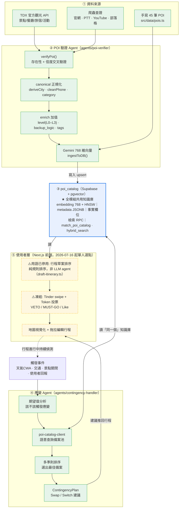

# Navigator 整合架構圖（知識圖譜）

> 用途：回應教授「各模組感覺各做各的」的疑慮，把「景點驗證 → 知識庫 → 應變 → 使用者」整條資料流畫成一張圖。
> 一句話：**`poi_catalog` 是全系統的樞紐——驗證 Agent 寫進去、應變 Agent 與行程規劃都從同一個它讀出來，模組是靠這個共用知識庫串起來的，不是各自為政。**

---

## 1. 整合資料流總圖

**圖例**：🟩 綠（實線）＝已實作　🟨 黃（虛線）＝規劃中／原型　🟦 藍＝共用樞紐。

> ⚠️ 2026-07-16 拍板：`SWIPE`（Tinder swipe + Token 投票）節點已凍結／移出範圍，定位收斂為單人從驗證庫選點成行程，取代投票收斂。程式碼保留未刪，不再開發。詳見 `0716_減法決策與不做清單.md`、`CLAUDE.md` §7.5。

---

## 2. 為什麼這回答了「各做各的」

| 教授的印象 | 圖上的事實 |
|---|---|
| 「景點驗證」「應變」「介面」像各做各的 | 三者都**接在 ③ `poi_catalog` 上**：②寫入、④與⑤讀出 |
| 模組之間沒有共同語言 | 共同語言就是 **canonical schema（L0–L3、backup_logic、metadata）**，②產生、③儲存、④消費 |
| 看不出資料怎麼流到使用者 | ①→②→③→⑤ 是「平時規劃」路徑；**③→④→⑤ 是「出狀況時」路徑**，兩條都經過同一個知識庫 |

一句話講給教授：**「驗證和應變不是兩個專案——它們是同一個知識庫的『生產者』和『消費者』。驗證負責把可信景點寫進 `poi_catalog`，應變在行程出狀況時，從同一個庫即時撈出合格備案。」**

---

## 3. 樞紐 `poi_catalog`：誰寫、誰讀

| 角色 | 模組 | 動作 | 進入點 |
|---|---|---|---|
| **生產者（寫）** | POI 驗證 Agent | `upsert`（向量 + metadata + 事實欄位） | `agents/poi-verifier/src/ingestion.ts` `ingestToDB()` |
| **生產者（寫）** | TDX 匯入 pipeline | 同上，走 TDX 來源 | `agents/poi-verifier/ingest-from-tdx.ts` |
| **消費者（讀）** | 應變 Agent | 語意查詢備案池（`match_poi_catalog` RPC） | `agents/contingency-handler/src/poi-catalog-client.ts` |
| **消費者（讀）** | 行程規劃／前端 | 候選景點檢索（規劃中） | `src/`（Next.js） |

---

## 4. 圖上節點 → 實際檔案對照（可驗證）

| 圖上節點 | 對應檔案 / 物件 |
|---|---|
| ② verifyPoi | `agents/poi-verifier/src/agent.ts` |
| ② canonical 正規化 | `agents/poi-verifier/src/canonical-poi.ts` |
| ② enrich 加值 | `agents/poi-verifier/src/enrichers/resilience-generator.ts`、`multi-criteria-ranker.ts` |
| ② 爬蟲查證 | `agents/poi-verifier/src/validators/{osm,blog-search,ptt-search,youtube-search}.ts` |
| ② 768 向量 + 寫入 | `agents/poi-verifier/src/ingestion.ts`（`getEmbedding`、`ingestToDB`） |
| ③ poi_catalog 表 + 索引 | `supabase/migrations/004_poi_catalog.sql`、`006_embedding_768.sql`、`008_*.sql` |
| ③ 檢索 RPC | `match_poi_catalog`（004/006）、`hybrid_search_poi_catalog`（007） |
| ④ 查詢備案池 | `agents/contingency-handler/src/poi-catalog-client.ts` |
| ④ 期望值 / 排序 / 計畫 | `agents/contingency-handler/src/`（`types.ts` 定義 EV、多準則權重、ContingencyPlan） |
| ⑤ 前端 / 規劃 | `src/app`、`src/components`、`src/data/pois.ts` |

---

## 5. 實作狀態（誠實版，教授會追問）

| 區塊 | 狀態 | 備註 |
|---|---|---|
| ② POI 驗證 + canonical + enrich + 768 向量 | ✅ 已實作 | canonical 60、TDX pipeline 98 測試全綠 |
| ② TDX 匯入 pipeline | ✅ 已實作 | 真實 TDX 資料驗證過；**全量 ingest 尚未跑**（規模化數字待補） |
| ③ poi_catalog + 雙檢索 RPC | ✅ 已實作（migration） | ⚠️ **目前 Supabase 專案連不上（DNS 查無此網域），要先恢復** |
| ④ 應變 Agent（查詢 + 期望值 + 多準則 + 計畫） | ✅ 已實作 | 讀 `poi_catalog`；雨天/景點關閉兩個 demo 情境 |
| ⑤ 前端（行程草案排序、地圖） | 🟡 規劃中／原型 | 單人選點成行程（2026-07-16 起，取代投票），純規則排序無 LLM；「Architect Agent」一詞已停用，見 `系統架構圖_競賽版.md`；CLAUDE.md：UI 暫停、邏輯優先 |
| ⑤ swipe / Token 投票 | 🧊 已凍結（2026-07-16） | 程式碼保留不開發，不入架構敘事，見 `CLAUDE.md` §7.5 |

> 這張圖的**綠色骨幹（②→③→④）已經是串起來的**；黃色（⑤）是下一步的整合方向。對教授可以這樣定位：**「核心的可信度＋應變骨幹已整合完成，使用者層是接下來要補的最後一段。」**

---

## 6. 已知阻塞

- **Supabase 連線**：專案網址 DNS 無法解析（疑似被刪或換網址），③ 的實際讀寫、TDX 全量匯入、migration 008 套用全部卡在此前置，需有後台權限的組員處理。
- 細節見 `agents/poi-verifier/docs/2026-06-04_2026-06-30_開發進度白話說明.md` §7。
