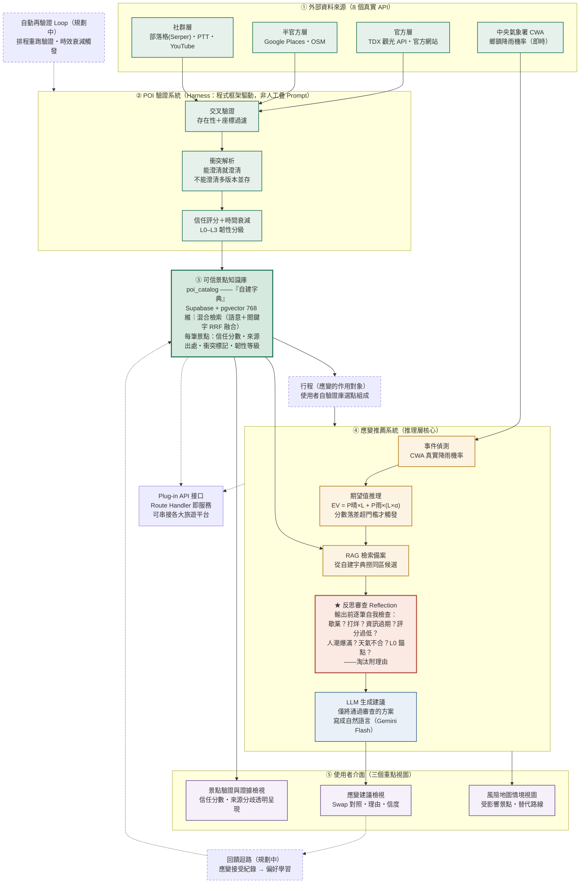

# 領航者 Navigator — 系統架構圖（競賽版）

> **核心敘事**：我們不是做一般旅遊規劃 App，而是做一個**以可信 POI 資料為基礎、能在突發狀況下提供可靠應變計畫的系統**——並以 Plug-in 服務形式，可被任何旅遊平台串接。
>
> **版本關係**：`系統架構圖_0709.md` 為對內完整版（教授核可）；本版為**對外競賽版**，依 0716 減法決策（見 `0716_減法決策與不做清單.md`）收斂到差異化主線——多人規劃、通用 App 功能（房間/投票/儀表板/通用行程生成）不入圖。

---

## 三層架構定位（Data Layer / Inference Layer / LLM）

| 層 | 對應模組 | 職責 | 關鍵設計 |
|---|---|---|---|
| **資料層 Data Layer** | ① 外部來源 → ② POI 驗證 → ③ 知識庫 | 收集、驗證、整理旅遊資訊 | 多來源交叉驗證＋衝突透明化，「自己編自己的字典」 |
| **推理層 Inference Layer** | ④ 應變推薦系統 | 邏輯判斷與決策 | 期望值模型決定「該不該換」、反思審查決定「換得對不對」 |
| **LLM 層** | ④ 末端生成 | 僅將**已決定的方案**轉為自然語言建議 | 生成內容受控於已驗證資料，從源頭抑制幻覺 |

> 關鍵主張：**LLM 不做決策**。要不要應變由期望值公式決定、換成哪裡由檢索與反思審查決定，LLM 只負責把結論說得通順。

---

## 主線架構圖



**圖例**：綠＝資料層｜琥珀＝推理層｜藍＝LLM 層｜紫＝介面｜紅框＝反思審查（Agentic 亮點）｜虛線＝規劃中／輔助。

---

## Agentic Pattern 落點（回應 Loop / Evaluation & Reflection）

| Agentic 要素 | 本系統落點 | 狀態 |
|---|---|---|
| **Harness Engineering** | 驗證與應變皆為結構化管線（validators → resolver → enrich → ingest；detect → EV → retrieve → reflect → generate），每個 LLM 呼叫都被程式框架包裹（schema 驗證、重試、防截斷）；**規則引擎對 LLM 具覆蓋權**——L0 分級由規則判定即為最終結果，LLM 不同意也不能改（`enrichers/index.ts`，0718 實作） | ✅ 已實作 |
| **Evaluation & Reflection** | 反思審查：備案輸出前逐筆過 7 項規則檢查，不合格者淘汰並記錄理由；LLM 重排另對每筆候選打分附理由 | ✅ 核心已實作（strict-checker＋reranker），呈現層強化中 |
| **Loop（生成後反思迴路）** | 應變敘述「生成 → 自檢 → 帶理由重生成」的迭代閉環：LLM 輸出前對照封閉候選集逐項檢查（幻覺景點／已淘汰景點／格式違規），不合格理由回填 prompt 重生成，用盡次數退回規則保底 | ✅ 已實作（2026-07-19，`narrative-checker.ts`＋generator 迴圈，單元測試 10/10） |
| **Loop（自動更新）** | 排程再驗證：依時間衰減觸發重跑驗證管線，讓字典隨時間自我更新 | 🔧 規劃中（管線可重入、確定性 UUID upsert 已就緒） |
| **回饋迴路** | 應變建議接受與否回收為偏好訊號 | 🔧 規劃中 |

### 反思迴路（Loop Engineering 落點，✅ 已實作）

反思分「生成前」與「生成後」兩段，合起來才是完整的 Reflection Loop：

- **生成前**（`strict-checker.ts`）：七項規則過濾候選池，不合格者淘汰並記錄結構化理由
- **生成後**（`narrative-checker.ts`＋generator 迴圈，2026-07-19 實作）：

```
LLM 生成應變敘述
  → 輸出前對照封閉候選集自檢：
     提及幻覺景點？提及已被淘汰的景點（含淘汰理由）？markdown／空輸出／超長？
  → 不合格 → 違規理由回填 prompt（「上一次生成未通過反思審查，問題如下…」）
  → 重新生成（次數上限 max_narrative_reflection_attempts，防無限迴圈）
  → 通過 → 輸出；用盡次數 → 退回規則保底文字（strategy.description）
```

每次應變回應都帶 `narrative_reflection`（生成次數／是否通過／逐輪違規記錄），前端可直接呈現「反思審查通過（第 N 次生成）」。設計要點：**LLM 在本系統只負責表述不做決策**，所以生成後要防的正是表述層的幻覺——推薦了不存在或已被審查淘汰的景點；決策層（EV、候選排序）本來就在 LLM 之外，不受幻覺影響。

---

## 圖上節點 → 真實程式碼對照（可驗證）

| 節點 | 檔案 |
|---|---|
| 交叉驗證 | `agents/poi-verifier/src/validators/`（google-places / osm / blog / ptt / youtube / official-website） |
| 衝突解析 | `agents/poi-verifier/src/conflict-resolver.ts`（45 筆實測：32 衝突／13 乾淨） |
| 信任評分＋L0–L3 分級 | `agents/poi-verifier/src/enrichers/`（規則引擎判定優先於 LLM 建議） |
| 知識庫＋混合檢索 | `supabase/migrations/004/006/007`、`hybrid_search_poi_catalog` RPC |
| 事件偵測（CWA） | `agents/contingency-handler/src/detectors/weather-detector.ts` |
| 期望值推理 | `agents/contingency-handler/src/evaluators/expected-value-calculator.ts` |
| **反思審查（生成前）** | `agents/contingency-handler/src/evaluators/strict-checker.ts` |
| **反思迴路（生成後）** | `agents/contingency-handler/src/evaluators/narrative-checker.ts`＋`generators/contingency-plan-generator.ts` 迴圈 |
| LLM 生成建議 | `agents/contingency-handler/src/generators/contingency-plan-generator.ts` |
| Plug-in API | `src/app/api/poi/search/route.ts`（POST／GET） |
| 行程（選點組成） | `src/lib/draft-itinerary.ts`（v0.3 改單人選點輸入） |
| 驗證檢視 UI | `src/app/(app)/explore/page.tsx`（信任分數＋衝突徽章） |

---

## 規模化與商業定位（Plug-in）

- **不做獨立 App 下載競賽**：系統的價值出口是 **Plug-in API**——旅遊平台（旅行社、OTA、出行服務）串接我們的「可信景點檢索」與「應變建議」端點，即可為自家用戶加值。
- **可規模化**：知識庫以 TDX 官方資料為擴充主力（全台涵蓋），pgvector 於數萬筆規模仍維持效能；單次檢索成本經漏斗式設計壓在 NT$5 以下，服務可複製到任何縣市、任何平台。
- **最嚴苛情境即賣點**：颱風等突發狀況下，一般 LLM 會給危險的幻覺建議；本系統的建議經過「已驗證資料 → 期望值推理 → 反思審查」三道關卡，才交由 LLM 表述。
